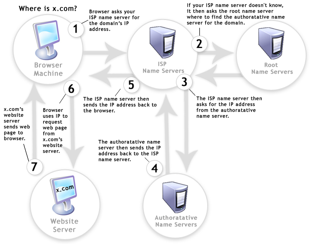
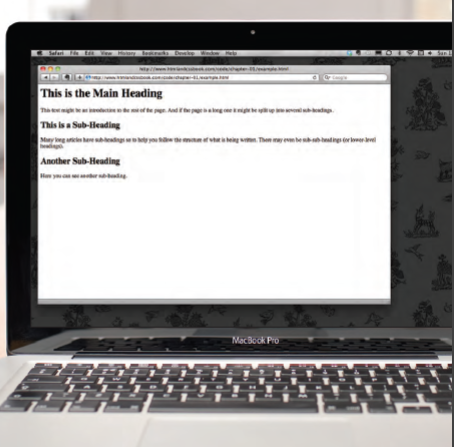
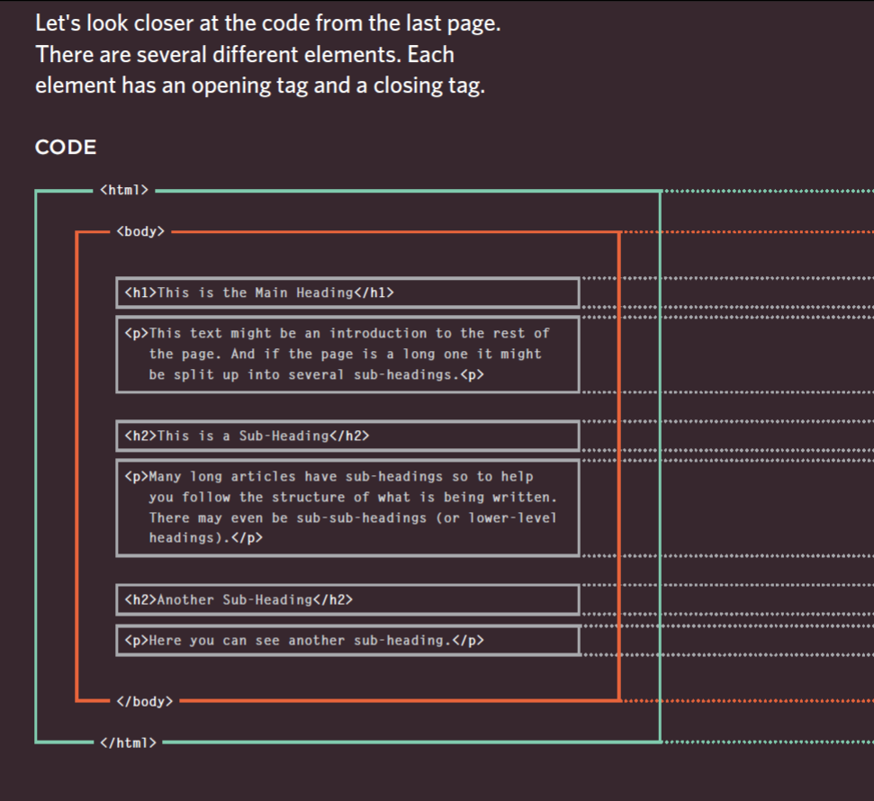
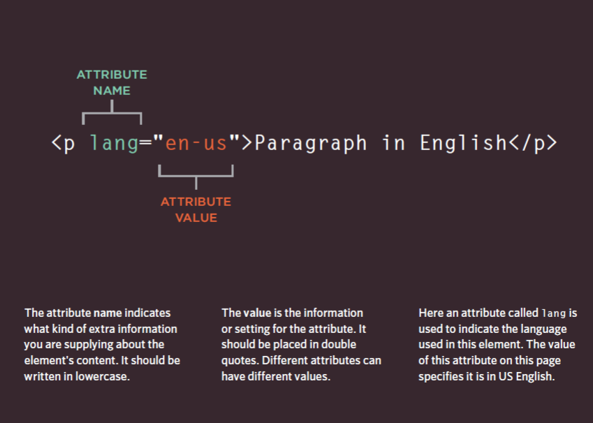
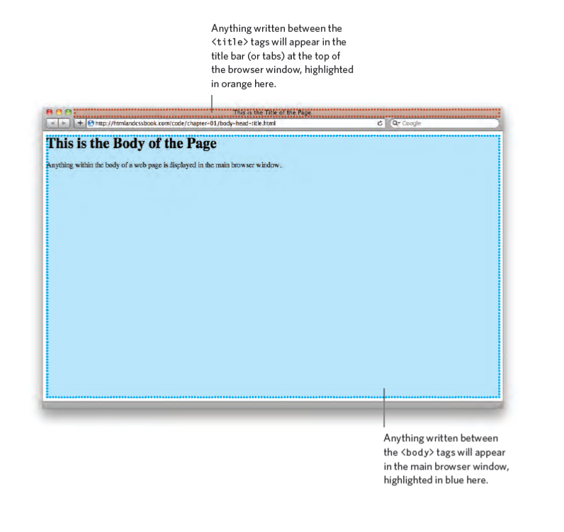

# HTML 
You may know that HTML
stands for HyperText Markup
Language. The HyperText part
refers to the fact that HTML
allows you to create links that
allow visitors to move from one
page to another quickly and
easily. A markup language allows
you to annotate text, and these
annotations provide additional
meaning to the contents of a
document. If you think of a web
page, we add code around the
original text we want to display
and the browser then uses
the code to display the page
correctly. So the tags we add are
the markup.
## How people access the web?
* People can access  the web by using devices such as desktop computer, laptops, tablets, mobile phones, each one have a different screen size and some have faster connections to the web than others.

* People use software called **web browser**, like Firefox, Internet Explorer, Safari, Chrome, and Opera to access the websites.
* **Web servers** are special computer that are constantly connected to the Internet, and are optimized to send web pages out to people who request them.

* Use screen reader is a program that read a content of a computer screen to users, they commonly used by people who have a virtual impairment also can be used for people are unable to read a screen such as when they are driving or jogging.

## How website are created?
 The web browser interprets the HTML and CSS code to create the page that you see.
Small websites are often written just using HTML and CSS. 
Larger websites — in particular those that are updated regularly and use a [content management system](https://en.wikipedia.org/wiki/Content_management_system) **(CMS)**, blogging tools, or e-commerce software — often make use of more complex
technologies on the web server, but these technologies are actually used to produce HTML
and CSS that is then sent to the browser.
Larger, more complex sites like these may use a database to store data, and programming
languages such as PHP, ASP.Net, Java, or Ruby on the web server.

## How the web works?

When you visit a website, the web server hosting that site could be anywhere in the world. 
In order for you to find the location of the web server, your browser will first connect to a **Domain Name System (DNS)** server, the **Domain Name System (DNS)** is a hierarchical and decentralized naming system for computers, services, or other resources connected to the Internet or a private network. It associates various information with domain names assigned to each of the participating entities. Most prominently, it translates more readily memorized domain names to the numerical IP addresses needed for locating and identifying computer services and devices with the underlying network protocols.





## Structure
In all kinds of documents, structure is very important in helping readers to understand the messages you are trying to convey and to navigate around the document.
The structure is very similar online


---
The use of headings and subheadings in any document often reflects a hierarchy of information. For example, a document might start with a large heading, followed by an introduction or the most important information. This might be expanded upon under subheadings lower down on the page. When using a word processor to create a document, we separate out the text to give it structure. Each topic might have a new paragraph, and each section can have a heading to describe what it covers.


---
HTML Describes the Structure of Pages, the HTML code is made up of characters that live inside angled brackets — these are called HTML elements. 
Elements are usually made up of two tags: an opening tag and a closing tag. (The closing tag has an extra forward slash in it.) Each HTML element tells the browser something about the information that sits between its opening and closing tags, so elements used to Describe the Structure of Pages.


--
Tags act like containers. They tell you something about the information that lies between their opening and closing tags.

##### Opening Tag: `<p>`
##### Closing Tag: `</p>`

## Attributes 
Attributes provide additional information
about the contents of an element. They appear
on the opening tag of the element and are
made up of two parts: a *name* and a *value*,
separated by an equals sign.




## Body, Head & Title in HTML
#### Example
 

```
<html>
	<body>
		<h1>This is the Main Heading</h1>
		<p>This text might be an introduction to the rest of the page. And if the page is a 
			 long one it might be split up into several sub-headings.<p>
		<h2>This is a Sub-Heading</h2>
		<p>Many long articles have sub-headings so to help you follow the structure of what 
			 is being written. There may even be sub-sub-headings (or lower-level headings).
			 </p>
		<h2>Another Sub-Heading</h2>
		<p>Here you can see another sub-heading.</p>
	</body>
</html>
```

---
You met the **<body>** element
in the first example we created.
Everything inside this element is
shown inside the main browser
window.

Before the <body> element you
will often see a **<head>** element.
This contains information
about the page (rather than
information that is shown within
the main part of the browser
window that is highlighted in
blue on the opposite page).
You will usually find a <title>
element inside the <head>
element.

The contents of the **<title>** element are either shown in the
top of the browser, above where you usually type in the URL of
the page you want to visit, or on the tab for that page (if your
browser uses tabs to allow you to view multiple pages at the
same time).





## Code in a Content Management System
The advantage of this approach is that people who do not know how to write web pages can add information to a website and it is also possible to change the presentation of something in the template, and it will automatically update every page that uses that template. If you imagine an e-commerce store with 1,000 items for sale, just altering one template is a lot easier than changing the page for each individual product. In systems like this, when you have a large block of text that you can edit, such as a news article, blog entry or the
description of a product in an e-commerce store, you will often see a text editor displayed.

#### Some content management systems offer tools that also allow you to edit the template files. If you do try to edit template files you need to check the documentation for your CMS as they all differ from each other. You need to be careful when editing template files because if you delete the wrong piece of code or add something in the wrong place the site may stop working entirely.


## The Evolution of HTML

###  HTML 4 Released 1997
HTML 4 had some
presentational elements to control the appearance of pages, authors are not recommended to use them any more. (Examples include the <center> element for centering content on a page, <font> for  controlling the appearance of text, and <strike> to put a line through
the text — all of these can be achieved with CSS instead.)

### XHTML 1.0 Released 2000

In 1998, a language called XML was published. Its purpose was to allow people to write new markup languages. Since HTML was the most widely used markup language around, it was decided that HTML 4 should be reformulated to follow the rules of XML and it was renamed XHTML. This meant that authors had to follow some new, more strict rules about writing markup. For example:

* Every element needed a closing tag (except for empty elements such as ).

* Attribute names had to be in lowercase.
* All attributes required a value, and all values were to be placed in double quotes.
* Deprecated elements should no longer be used.
* Every element that was opened inside another element should be closed inside that same element.

####  XHTML 1.0 have three versions:
*1. **Strict XHTML 1.0**, where authors had to follow the rules to the letter.*

*2.  **Transitional XHTML 1.0**, where authors could still use 
presentational elements (such as <center> and <font>).*

*3. **XHTML 1.0 Frameset**, which allowed web page authors to partition
a browser window into several "frames," each of which would hold a different HTML page.*

### HTML5 Released 2000
In HTML5, web page authors do not need to close all tags, and new elements and attributes will be introduced.


