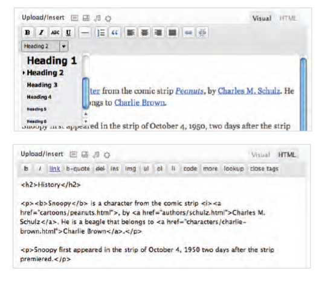
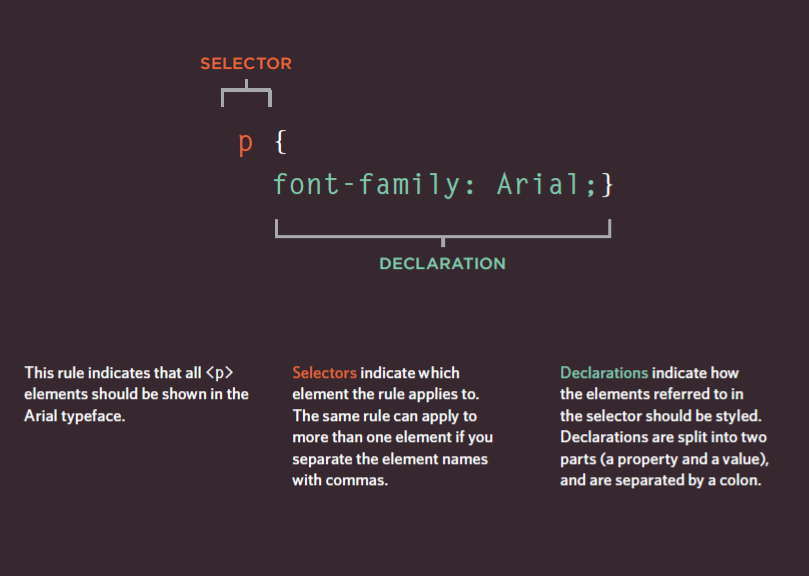
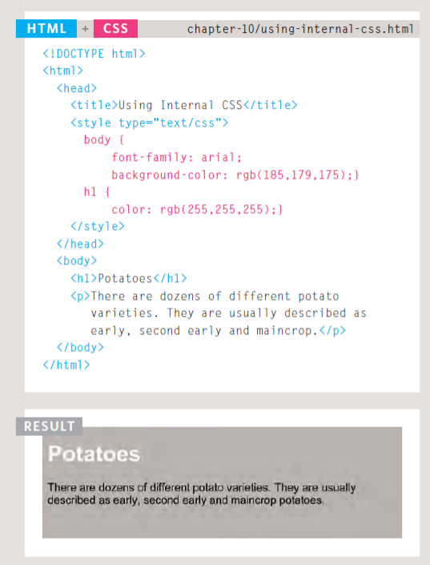

# Text in HTML
### HTML has six "levels" of headings:

```
<h1>This is a Main Heading</h1>
<h2>This is a Level 2 Heading</h2>
<h3>This is a Level 3 Heading</h3>
<h4>This is a Level 4 Heading</h4>
<h5>This is a Level 5 Heading</h5>
<h6>This is a Level 6 Heading</h6>
```
### Bold & Italic

* By enclosing words in the tags <b> and </b> we can make characters appear bold. The <b> element also represents a section of text that would be presented in a visually different way (for example key words in a paragraph) although the use of the <b> element does not imply any  additional meaning.
 
 * By enclosing words in the tags <i> and </i> we can make characters appear italic. The <i> element also represents a section of text that would be said in a different way from surrounding content — such as technical terms, names of ships, foreign words, thoughts, or other terms that would usually be italicized.

 ### Line Breaks & Horizontal Rules

As you have already seen, the browser will automatically show each new paragraph or heading on a new line. But if you wanted to add a line  break inside the middle of a paragraph you can use the line break <br  /> tag.

 To create a break between themes — such as a change of topic in a book or a new scene in a play — you can add a horizontal rule between sections
using the <hr /> tag.

## Visual editors
Visual editors often resemble word processors. Although each editor will differ slightly, there are some features that are common to most editors
that allow you to control the presentation of text. 




* Headings are created by
highlighting text then using
a drop-down box to select a
heading. 

* Bold and italic text are
created by highlighting some
text and pressing a b or i
button. 

* New paragraphs are created
using the return or the enter
key.

* Line breaks are created by
pressing the shift key and the
return key at the same time.

* Horizontal rules are created
using a button with a straight
line on it.

## Semantic Markup
*In the rest of the chapter you will meet some more elements that will help you when you are adding text to web pages. For example, you are going to meet the \<em \> element that allows you to indicate where emphasis
should be placed on selected words and the \<blockquote\> element which  indicates that a block of text is a quotation.*

## Citations & Definitions

* When you are referencing a piece of work such as a book, film or  research paper, the <cite> element can be used to indicate where the citation is from.
In HTML5, <cite> should not really be used for a person's name — but it was allowed in HTML 4, so most people are likely to continue to use it.


* The first time you explain some new terminology (perhaps anacademic concept or some jargon) in a document, it is known as the defining instance of it. The <dfn> element is used to indicate the defining  instance of a new term. Some browsers show the content of the <dfn> element in italics. Safari and Chrome do not change its appearance.


# CSS
##### CSS allows you to create rules that specify how the content of an element should appear. For example, you can specify that the background of the page is cream, all paragraphs should appear in gray using the Arial typeface, or that all level one headings should be in a blue, italic, Times typeface.

## BLOCK & INLINE ELEMENT
You may remember from pages 185-186 that in there is a difference between block leveland inline elements and how how browsers display them. 
Block level elements look like they start on a new line. Examples include the <h1>- <h6>, <p> and <div> elements.

CSS works by associating rules with HTML elements. These rules govern
how the content of specified elements should be displayed. A CSS rule
contains two parts: a **selector** and a **declaration**.



## Using internal CSS

When building a site with more than one page, you should use an external CSS style sheet. This:

* Allows all pages to use the same style rules (rather than repeating them in each page).

* Keeps the content separate from how the page looks.

* Means you can change the styles used across all pages by altering just one file (rather than each individual page).




Selector         | Meaning      | Example
----------------|-------------|--------
Universal Selector |Applies to all elements in the document | * {}
Type Selector     | Matches element names | h1, h2, h3 {}
Chil d Selector   |Matches an element that is a direct child of another | li>a {}
Adjacent Sibling Selector       | Matches an element that is the next sibling of another | h1+p {}

## Statments in JS
A script is a series of instructions that a computer can follow one-by-one. Each individual instruction or step is known as a **statement**.
 Statements should end with a semicolon 

```
var today= new Date{);
var hourNow = today.getHours{) ;
var greeting;
if (hourNow > 18) {
greeting= 'Good evening';
else if (hourNow > 12) {
greeting= 'Good afternoon';
else if (hourNow > O) {
greeting 'Good morning';
else {
greeting 'Welcome';
document.write(greeting)
```
## THE RULES FOR NAMING VARIABLES

1- The name must begin with a letter, dollar sign ($),or an underscore (_). It must not start with a number.

2- All variables are case sensitive,so score and Score would be different variable names, but it is bad practice to create two variables that have the same name using different cases.

3- The name can contain letters, numbers, dollar sign ($), or an underscore (_). Note that you must not use a dash(-) or a period (.) in a variable name.

4- Use a name that describes the kind of information that the variable stores. For example, fi rstName might be used to store a person's first name, l astNarne for their last name, and age for their age.

5- You cannot use keywords or reserved words. Keywords are special words that tell theinterpreter to do something. For example, var is a keyword used to declare a variable. Reserved words are ones that may be used in a future version of JavaScript. *ONLINE EXTRA* View a full list of keywords and reserved words in JavaScript.

6- If your variable name is made up of more than one word, use a capital letter for the first letter of every word after the first word. For example, f i rstName rather than fi rstnarne (this is referred to as camel case). You can also use an underscore between each word (you cannot use a dash).

NAME | OPERATOR | PURPOSE & NOTES |EXAMPLE 
-----|----------|-----------------|--------------
ADDITION | +    |Adds one value to another |10 + 5 is 15
SUBTRACTION | -   |Subtracts one value from another |10 - 5 is 5
DIVISION | /   | I Divides two values |10 / 5 is  2
MULTIPLICATION |*   |Multiplies two values |10 * 5 is 50
