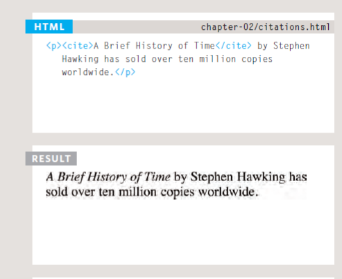
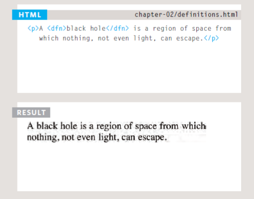

# Text in HTML
### HTML has six "levels" of headings:

```
<h1>This is a Main Heading</h1>
<h2>This is a Level 2 Heading</h2>
<h3>This is a Level 3 Heading</h3>
<h4>This is a Level 4 Heading</h4>
<h5>This is a Level 5 Heading</h5>
<h6>This is a Level 6 Heading</h6>
```
### Bold & Italic
* By enclosing words in the tags <b> and </b> we can make characters appear bold. The <b> element also represents a section of text that would be presented in a visually different way (for example key words in a paragraph) although the use of the <b> element does not imply any  additional meaning.
 
 * By enclosing words in the tags <i> and </i> we can make characters appear italic. The <i> element also represents a section of text that would be said in a different way from surrounding content — such as technical terms, names of ships, foreign words, thoughts, or other terms that would usually be italicized .

 ### Line Breaks & Horizontal Rules
As you have already seen, the browser will automatically show each new paragraph or heading on a new line. But if you wanted to add a line  break inside the middle of a paragraph you can use the line break tag <br />.

 To create a break between themes — such as a change of topic in a book or a new scene in a play — you can add a horizontal rule between sections
using the <hr /> tag .

## Visual editors
Visual editors often resemble word processors. Although each editor will differ slightly, there are some features that are common to most editors
that allow you to control the presentation of text.

* Headings are created by
highlighting text then using
a drop-down box to select a
heading. 

* Bold and italic text are
created by highlighting some
text and pressing a b or i
button. 

* New paragraphs are created
using the return or the enter
key.

* Line breaks are created by
pressing the shift key and the
return key at the same time.

* Horizontal rules are created
using a button with a straight
line on it.

## Semantic Markup
*In the rest of the chapter you will meet some more elements that will help you when you are adding text to web pages. For example, you are going to meet the \<em \> element that allows you to indicate where emphasis
should be placed on selected words and the \<blockquote\> element which  indicates that a block of text is a quotation.*

## Citations & Definitions

* When you are referencing a piece of work such as a book, film or  research paper, the <cite> element can be used to indicate where the citation is from.
In HTML5, <cite> should not really be used for a person's name — but it was allowed in HTML 4, so most people are likely to continue to use it.



* The first time you explain some new terminology (perhaps anacademic concept or some jargon) in a document, it is known as the defining instance of it. The <dfn> element is used to indicate the defining  instance of a new term. Some browsers show the content of the <dfn> element in italics. Safari and Chrome do not change its appearance.




