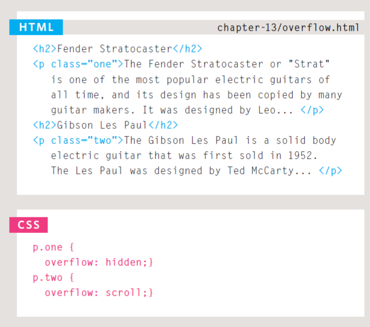
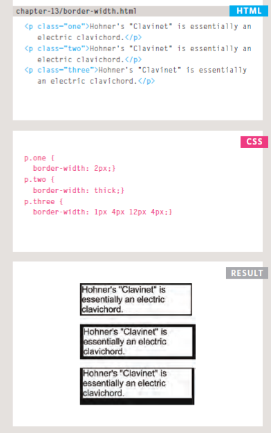
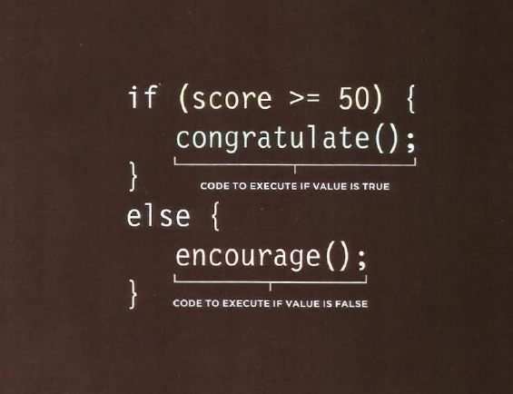
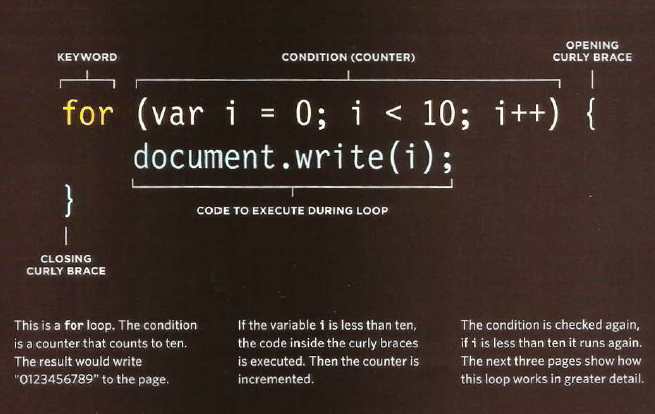

# HTML Lists, Control Flow with JS, and the CSS Box Model

## Lists
**the types of lists:**
* Ordered lists are lists where each item in the list is numbered. For example, the list might be a set of steps for a recipe that must be performed in order, or a legal contract where each point needs to be identified by a section number.

The ordered list is created with the <ol> element. 

Each item in the list is placed between an opening <li> tag and a closing </li> tag. (The li stands for list item.)
*Example*
```
<ol>
<li>Chop potatoes into quarters</li>
<li>Simmer in salted water for 15-20
minutes until tender</li>
<li>Heat milk, butter and nutmeg</li>
<li>Drain potatoes and mash</li>
<li>Mix in the milk mixture</li>
</ol>
```
* Unordered lists are lists that begin with a bullet point (rather than characters that indicate order).

The unordered list is created with the <ul> element. 
Each item in the list is placed between an opening <li> tag and a closing </li> tag. (The li stands for list item.)

*Example*

```
<ul>
<li>1kg King Edward potatoes</li>
<li>100ml milk</li>
<li>50g salted butter</li>
<li>Freshly grated nutmeg</li>
<li>Salt and pepper to taste</li>
</ul>
```

* Definition lists are made up of a set of terms along with the definitions for each of those terms.
The definition list is created with the <dl> element and usually consists of a series of terms and their definitions. Inside the <dl> element you will usually see pairs of <dt> and <dd> elements.

*dt* This is used to contain the term being defined (the definition term)
*dd* This is used to contain the definition.


## Boxes

### Overflowing Content

The overflow property tells the browser what to do if the content contained within a box is larger than the box itself. It can have one of two values:


**hidden**

This property simply hides any extra content that does not fit in the box.

**scroll**

This property adds a scrollbar to the box so that users can scroll to see the missing content. On the left, you can see two boxes whose contents expand beyond their set dimensions. The first example has the overflow property with a value of hidden. 

The second example has the overflow property with a value of scroll.





**border-width**





## EXPRESSIONS in JS

An expression evaluates into (results in) a single value. Broadly peaking there are two types of expressions.

1. EXPRESSIONS THAT JUST ASSIGN A VALUE TO A VARIABLE In order for a variable to be useful, it needs to be given a value. As you have seen, this is done using the assignment operator (the equals sign). 


> var color = 'beige';

2. EXPRESSIONS THAT USE TWO OR MORE VALUES TO RETURN A SINGLE VALUE You can perform operations on any number of individual values (see next page) to determine a single value. For example:

> var area = 3 * 2;

## conditional statement 
**IF ELSE STATEMENT**



## Loops 

such as *FOR* , *while* or *DO..WHILE*

EXAMPLE on FOR LOOP:

