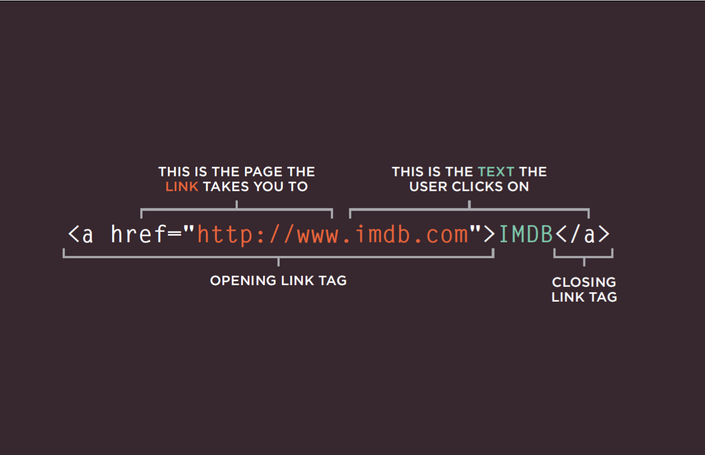
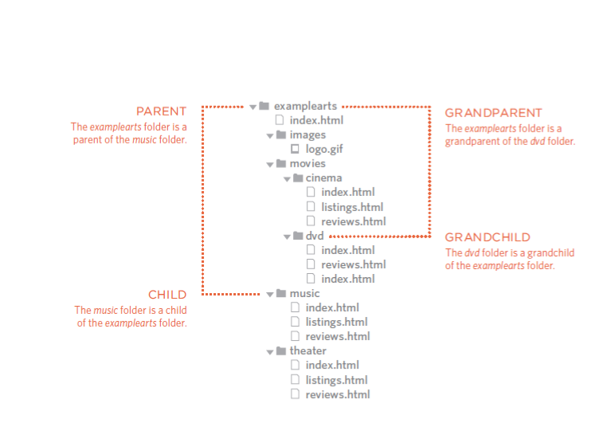
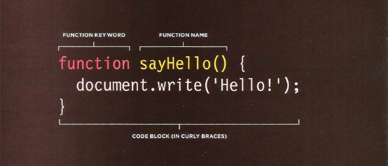

# HTML Links, JS Functions, and Intro to CSS Layout

## Writing Links

* How to write a link ? 

**Links are created using the <a> element. Users can click on anything between the opening <a> tag and the closing </a> tag. You specify which page you want to link to using the href attribute.**



* You can to Linking to Other Sites:

When you link to a different website, the value of the href attribute will be the full web address for the site, which is known as an *absolute* URL.

## Directory Structure

1. Structure

The diagram on the right shows the directory structure for a fictional entertainment listings website called ExampleArts. The top-level folder is known as the root folder. (In this example, the root folder is called examplearts.) The root folder contains all of the other files and folders for a website.

2. Rela tionships

The relationship between files and folders on a website is described using the same terminology as a family tree.

In the diagram on the right, you can see some relationships have been drawn in.

3. Homepages

The main homepage of a site written in HTML (and the homepages of each section in a child folder) is called index.html.
Web servers are usually set up to return the index.html file if no file name is specified.



## Layout
How to Controlling the Position of Elements ?

CSS has the following positioning schemes that allow you to control the layout of a page: normal flow, relative positioning, and absolute positioning. You specify the positioning scheme using the position property in CSS. You can also float elements using the float property.

1. Normal flow: Every block-level element appears on a new line, causing each item to appear lower down the page than the previous one. Even if you specify the width of the boxes and there is space for two elements to sit side-byside, they will not appear next to each other. This is the default behavior (unless you tell the browser to do something else).

2. Relative Positioning: This moves an element from the position it would be in normal flow, shifting it to the top, right, bottom, or left of where it would have been placed. This does not affect the position of surrounding elements; they stay in the position they would be in in normal flow.

3. Fixed Positioning: This is a form of absolute positioning that positions the element in relation to the browser window, as opposed to the containing element.

4. Floating Elements: Floating an element allows you to take that element out of normal flow and position it to the far left or right of a containing box. The floated element becomes a block-level element around which other content can flow.


## Using Float to Place Elements Side-by-Side

```
body {
width: 750px;
font-family: Arial, Verdana, sans-serif;
color: #665544;}
p {
width: 230px;
float: left;
margin: 5px;
padding: 5px;
background-color: #efefef;}
```


## Liquid Layouts

**Advantages**

* Pages expand to fill the entire browser window so there are no spaces around the page on a large screen.

* If the user has a small window, the page can contract to fit it without the user having to scroll to the side.

* The design is tolerant of users setting font sizes larger than the designer intended (because the page can stretch).

**Disadvantages**

* If you do not control the width of sections of the page then the design can look very different than you intended, with unexpected gaps around certain elements or items squashed together. 

* If the user has a wide window, lines of text can become very long, which makes them harder to read.

* If the user has a very narrow window, words may be squashed and you can end up with few words on each line.

* If a fixed width item (such as an image) is in a box that is too small to hold it (because the user has made the window smaller) the image can overflow over the text.


## WHAT IS A FUNCTION?
Functions let you group a series of statements together to perform a specific task. If different parts of a script repeat the same task, you can reuse the function (rather than repeating the same set of st atements).

Declaring a Function: 


