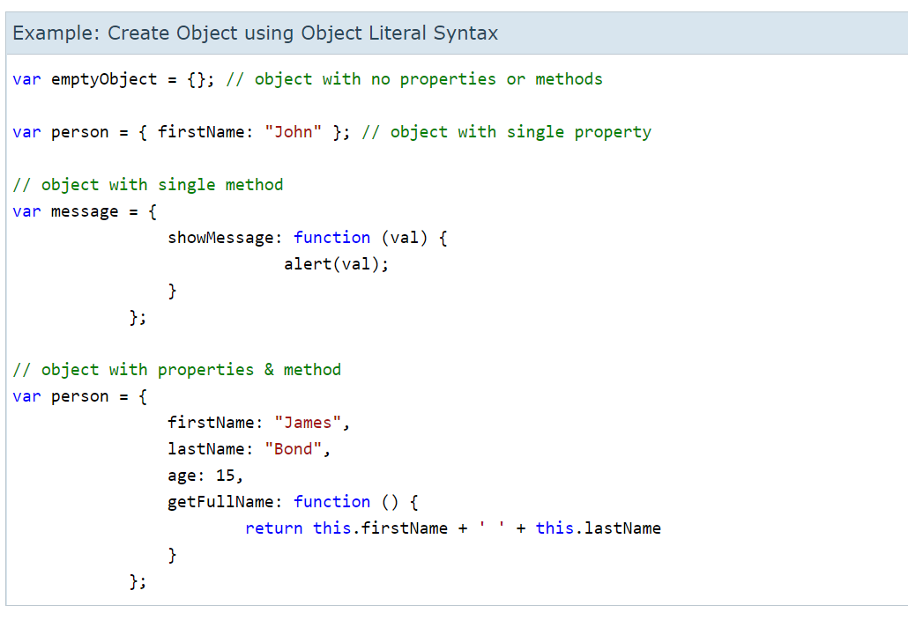
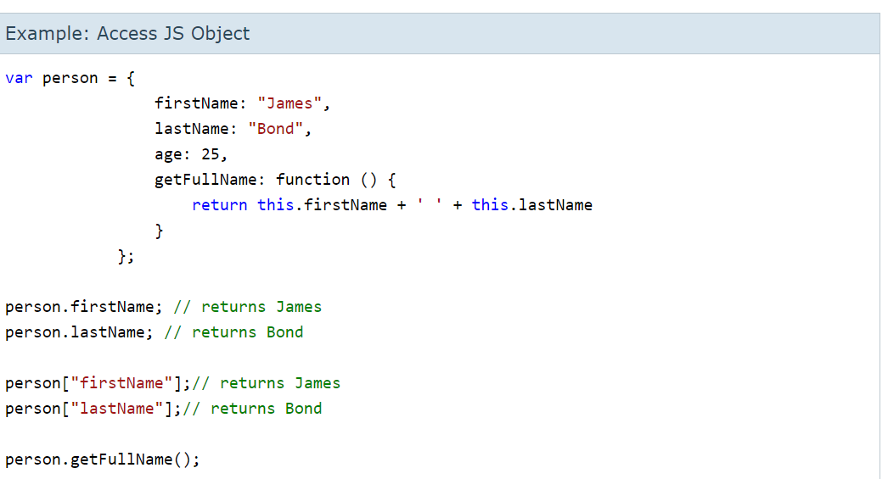

# Problem Domain, Objects, and the DOM

## How To Solve a Programming Problems??


* **Understanding the problem very will**
By reading the problem completely twice .

* **write an manual steps to solve the problem**
For example, when you have to sum two numbers and get the result you have to write the steps like:
1. start with setting new two words to but numbers that you want to sum them .
2. write expression  X + Y that you will use to sum the numbers.
3. return the result.

* **Optimize the manual solution**
People often don’t realize how valuable this step is.  It is much easier to rearrange and reconstruct and idea or algorithm in your head than it is in code.

* **Write pseudo-code or comments**
Example :
1. //number1 =4 , number2 = 6 , result =0
2. // result = number1 + number2
3. // return result

* **Replace comments with real code**


> let number1 = 4, number2 = 6 , result = 0 ;
>result = number1 + number2;
>console.log(result);


* **Optimize the real code**
Sometimes this step isn’t necessary, but it’s worth taking a look at your code and figuring out if you can cut out a few lines or do something simpler. this is also a good place to make sure all your variables are named with long meaningful names.  I cannot stress enough how important having good names for your variables and methods is for helping the person evaluating your code to understand what you were trying to do.  This is especially important when you make a mistake! , [click here](https://simpleprogrammer.com/understanding-the-problem-domain-is-the-hardest-part-of-programming) to read more .


## Objects
*object is a group together a set of variables and functions to create a modelling you would recognize in your real world.*

* in an object variables called **proprieties** which tell us about the object .
* In an object functions become knows as **Methods** that represent tasks that are associated with the object.
* the proprieties and methods in an object have **value** and **key** .

*Example*



* You can access the proprieties and methods in an object by using dot or square brackets .


## DOM
**The Document Object Model (DOM) specifies how browsers should create a model of an HTML page and how JavaScript can access and update the contents of a web page while it is in the browser window.**
As a browser loads a web page, it creates a model of that page. The model is called a DOM tree, and it is stored in the browsers' memory.


## DOM tree consists of four main types of nodes :

1. THE DOCUMENT NODE : when you access any element, attribute, or text node, you navigate to it via the document node. It is the starting point for all visits to the DOM tree.

2. ELEMENT NODES : To access the DOM tree, you start by looking for elements. Once you find the element you want, then you can access its text and attribute nodes if you want to. This is why you start by learning methods that allow you to access element nodes, before learning to access and alter text or attributes.
3. ATTRIBUTE NODES :  Attribute nodes are not children of the element thar carries them; they are part of that element. Once you access an element, there are specific JavaScript methods and properties to read or change that element's attributes. For example, it is common to change the values of cl ass attributes to trigger new 

4. TEXT NODES : Text nodes cannot have children. If an element contains text and another child element, the child element is not a child of the text node but rather a child of the containing element.

### To Accessing and updating the DOM tree involves two steps:

1. Locate the node that represents the element you want to work with.
2. Use its text content, child elements, and attributes.

* One property allows access to child elements and text content: *innerHTML*
* Several methods let you create new nodes, add nodes to a tree, and remove nodes from a tree:  *create Element(),createTextNode(), appendChild () / removeChild ()* This is called **DOM manipulation**
* Lets you get or update the value of the cl ass and id attributes.
*hasAttribute(), getAttribute(), setAttribute(), removeAttribute()* The first checks if an attribute exists. The second gets its value.The third upda*tes the value.The fourth removes an attribute.

* METHODS THAT RETURN A SINGLE ELEMENT NODE:
> getElementByld( 'id' )

* SELECTING ELEMENTS USING ID ATTRIBUTES:

```
// Html 
<hl id="header">List King</hl>
<h2>Buy groceries</h2>
<ul>
<li id="one" class="hot"><em>fresh<lem>
figs</li>
<li id="two" class="hot">pine nut s</li>
<li id="three" class="hot">honey</li>
<li id="four">balsamic vinegar</li>
</ul>

// js
// Select the element and store it in a variable.
var el = document.getElementByid('one');
// Change the value of the class attribute.
el.className ='cool ' ;
```


* METHODS THAT RETURN ONE OR MORE ELEMENTS (AS A NODELIST):
> getElementsByClassName('class')
> getElementsByTagName('tagName')

## A Nodelist is a collection of element nodes.
 Each node is given an index number (a number that starts at zero, just like an array). The order in which the element nodes are stored in a Node List is the same order that they appeared in the HTML page.
 Nodelists look like arrays and are numbered like arrays, but they are not actually arrays; they are a type of object called a **collection**.
**When a DOM query returns a Nodelist, you may want to:**
* Select one element from the NodeList.
* Loop through each item in the Nodelist and perform the same statements on each of the element nodes.

## UPDATING HTML CONTENT

So far, you have seen three techniques for adding HTML to a web page. It's time to compare when you should use each one.
> document.write()


*Advantages for using document.write()*
* It is a quick and easy way to show beginners how content can be added to a page.
*disadvantages for using document.write()*
* It only works when the page initially loads.
* If you use it after the page has loaded it can:
1. Overwrite the whole page 
2. Not add the content to the page
3. Create a new page
* It can cause problems with XHTML pages that are strictly validated.
* This method is very rarely used by programmers these days and is generally frowned upon.


