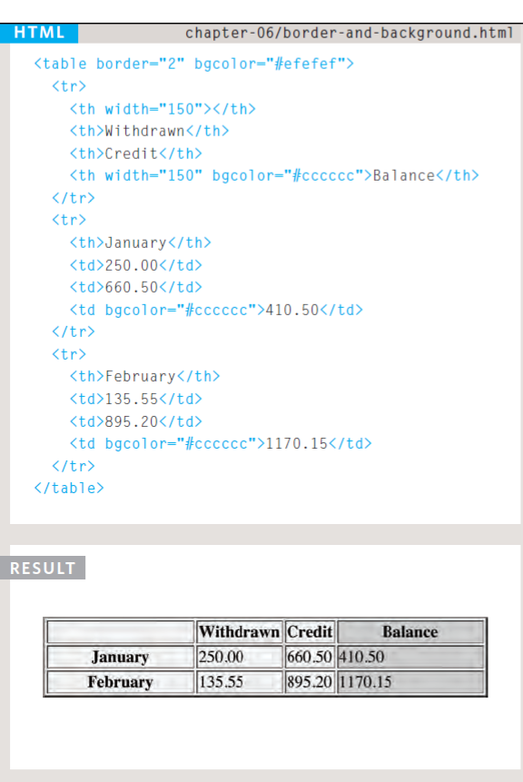
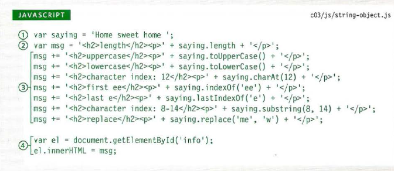

# Object-Oriented Programming, HTML Tables

## Domain Modeling
Domain modeling is the process of creating a conceptual model in code for a specific problem. A model describes the various entities, their attributes and behaviors, as well as the constraints that govern the problem domain.

### Define a constructor and initialize properties
To define the same properties between many objects, you'll want to use a constructor function. Below is a table that summarizes a JavaScript representation of an `EpicFailVideo` object.

Property  |	Data   | Type
----------|--------|------
epicRating |1 to 10 | Number
hasAnimals |true or false |	Boolean

* Here's an implementation of the EpicFailVideo constructor function.


```
var EpicFailVideo = function(epicRating, hasAnimals) {
  this.epicRating = epicRating;
  this.hasAnimals = hasAnimals;
}

var parkourFail = new EpicFailVideo(7, false);
var corgiFail = new EpicFailVideo(4, true);

console.log(parkourFail);
console.log(corgiFail);
```

### Some tips to follow when building your own domain models.

1. When modeling a single entity that'll have many instances, build self-contained objects with the same attributes and behaviors.

2. Model its attributes with a constructor function that defines and initializes properties.
3. Model its behaviors with small methods that focus on doing one job well.
4. Create instances using the new keyword followed by a call to a constructor function.
5. Store the newly created object in a variable so you can access its properties and methods from outside.
6. Use the this variable within methods so you can access the object's properties and methods from inside.

## Tables in Html 

* What is the table ?
A table represents information in a grid format. Examples of tables include financial reports, TV schedules, and sports results.

* Basic Table Structure

```
<table>
<tr>
<td>15</td>
<td>15</td>
<td>30</td>
</tr>
<tr>
<td>45</td>
<td>60</td>
<td>45</td>
</tr>
<tr>
<td>60</td>
<td>90</td>
<td>90</td>
</tr>
</table>
```

* Spanning Rows: 
You may also need entries in a table to stretch down across more than one row.
> \<td rowspan="2">Movie\</td>

* For long Tables we can use:
1.  **\<thead>** The headings of the table should sit inside the \<thead> element.
2. **\<tbody>** The body should sit inside the <tbody> element.
3. **\<tfoot>** The footer belongs inside the <tfoot> element.
By default, browsers rarely treat the content of these elements any differently than other elements however designers often use CSS styles to change.

* Border & Background:
*This example uses the HTML border and bgcolor attributes.*



## OBJECTS
### WHAT ARE BUILT-IN OBJECTS?
Browsers come with a set of built-in objects that represent things like the browser window and the current web page shown in that window. These built-in objects act like a toolkit for creating interactive web pages.

### THE DOCUMENT OBJECT
The topmost object in the Document Object Model (or DOM) is the document object.
Here are some properties of the document object, which tell you about the current page.

PROPERTY |DESCRIPTION
---------|-----------
document.title | Title of current document
document.lastModified |Date on which document was last modified
document .URL |Returns string containing URL of current document
document.domain | Returns domain of current document


### WORKING WITH STRINGS
This example demonstrates the 1 ength property and many of the string object's methods shown on the previous page.



### DATA TYPES REVISITED
1. Number
2. Boolean
3. String
4. Null
5. Undefined
6. Object

### GLOBAL OBJECTS: MATH OBJECT

PROPERTY | DESCRIPTION
---------|--------------
Math.PI | Returns pi (approximately 3.14159265359)
METHOD  |DESCRIPTION
Math.round() | Rounds number to the nearest integer
Math.sqrt(n) |Returns square root of positive number, e.g., Math. sqrt (9) returns 3
Math.ceil() | Rounds number up to the nearest integer

### WORKING WITH DATES & TIMES
The order and syntax for this is:
1. Year four digits
2. Month 0-11 (Jan is 0)
3. Day 1-31
4. Hour 0-23
5. Minutes 0-59
6. Seconds 0-59
7. Milliseconds 0-999


### for more information [click here](https://www.w3schools.com/js/js_object_definition.asp).


