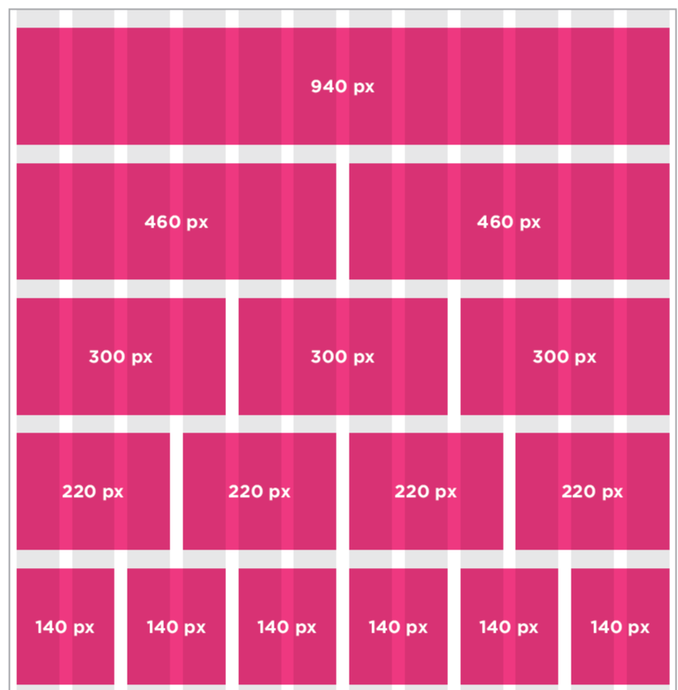
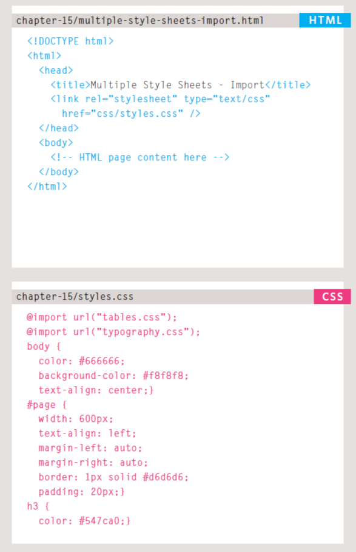

#CSS Layout


### CSS treats each HTML element as if it is in its own box. This box will either be a block-level box or an inline box.
Block-level boxes start on a new line and act as the main building blocks of any layout, while inline boxes flow between surrounding text. You can control how much space each box takes up by setting the width of the boxes (and sometimes the height, too). To separate boxes, you can use borders, margins, padding, and background colors.

## Page Sizes
As screen sizes have increased and handheld devices have become more popular, the area users will see is far more variable.

## How to Controlling the Position of Elements ?

CSS has the following positioning schemes that allow you to control the layout of a page: normal flow, relative positioning, and absolute positioning. You specify the positioning scheme using the position property in CSS. You can also float elements using the float property.

1. Normal flow: Every block-level element appears on a new line, causing each item to appear lower down the page than the previous one. Even if you specify the width of the boxes and there is space for two elements to sit side-byside, they will not appear next to each other. This is the default behavior (unless you tell the browser to do something else).

2. Relative Positioning: This moves an element from the position it would be in normal flow, shifting it to the top, right, bottom, or left of where it would have been placed. This does not affect the position of surrounding elements; they stay in the position they would be in in normal flow.

3. Fixed Positioning: This is a form of absolute positioning that positions the element in relation to the browser window, as opposed to the containing element.

4. Floating Elements: Floating an element allows you to take that element out of normal flow and position it to the far left or right of a containing box. The floated element becomes a block-level element around which other content can flow.


## Using Float to Place Elements Side-by-Side

```
body {
width: 750px;
font-family: Arial, Verdana, sans-serif;
color: #665544;}
p {
width: 230px;
float: left;
margin: 5px;
padding: 5px;
background-color: #efefef;}
```


## Liquid Layouts

**Advantages**

* Pages expand to fill the entire browser window so there are no spaces around the page on a large screen.

* If the user has a small window, the page can contract to fit it without the user having to scroll to the side.

* The design is tolerant of users setting font sizes larger than the designer intended (because the page can stretch).

**Disadvantages**

* If you do not control the width of sections of the page then the design can look very different than you intended, with unexpected gaps around certain elements or items squashed together. 

* If the user has a wide window, lines of text can become very long, which makes them harder to read.

* If the user has a very narrow window, words may be squashed and you can end up with few words on each line.

* If a fixed width item (such as an image) is in a box that is too small to hold it (because the user has made the window smaller) the image can overflow over the text.


## Layout Grids
*Grids set consistent proportions and spaces between items which helps to create a professional looking design.*

While a grid might seem like a restriction, in actual fact it:
1. Creates a continuity between different pages which may use different designs.
2. Helps users predict where to find information on various pages.
3. Makes it easier to add new content to the site in a consistent way.
4. Helps people collaborate on the design of a site in a consistent way.

## 960 Pixel wide 12 Column Grid




## CSS Frameworks


ADVANTAGES             | DISADVANTAGES
-----------------------|----------------
They save you from repeatedly writing code for the same tasks|They often require that you use class names in your HTML code that only control the presentation of the page (rather than describe its content).
They will have been tested across different browser versions (which helps avoid browser bugs). |   In order to satisfy a wide variety of needs, they often contain more code than you need for your particular  page (commonly referred to as code “bloat”).

## Multiple Style Sheets

There are two ways to add multiple style sheets to a page:
1. Your HTML page can link to one style sheet and that stylesheet can use the @import rule to import other style sheets.

2. In the HTML you can use a separate <link> element for each style sheet.
*Example*



### For more Example [CLICK HERE](https://www.w3schools.com/css/css_website_layout.asp).