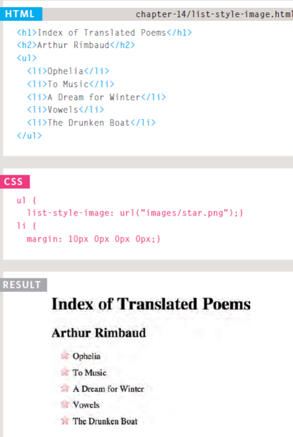
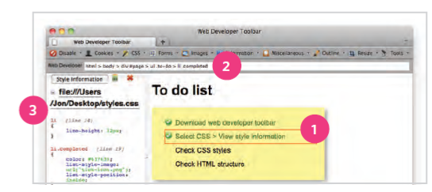
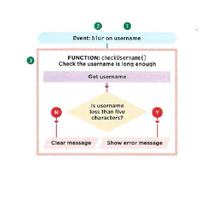
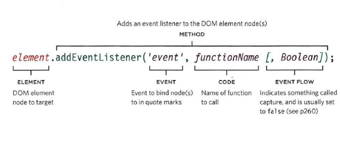

# Forms and JS Events

## Forms
*The \<form> element is a container for different types of input elements, such as: text fields, checkboxes, radio buttons, submit buttons, etc.*

### Form Controls
There are several types of form controls that you can use to collect information from visitors to your site.
1. ADDING TEXT: Like a single line text box but it masks the characters entered.
2. Making Choice s:
3. Submitting Forms: Uploading Files:
4. Password input
5. File upload


*Example on form*


### Form Structure
Form controls live inside a \<form> element. This element should always carry the action attribute and will usually have a method and id attribute too. action Every \<form> element requires an action attribute. Its value is the URL for the page on the server that will receive the information in the form when it is submitted. method Forms can be sent using one of two methods: **get or post**

```
<form action="http://www.example.com/subscribe.php"
method="get">
<p>This is where the form controls will appear.
</p>
</form>
```
* Text input
The \<input> element is used to create several different form controls. The value of the type attribute determines what kind of input they will be creating.
type="text" When the type attribute has a value of text, it creates a singleline text input.
When users enter information into a form, the server needs to know which form control each piece of data was entered into.
(For example, in a login form, the server needs to know what has been entered as the username and what has been given as the password.) Therefore, each form control requires a name attribute.
The value of this attribute identifies the form control and is sent along with the information they enter to the server.

>\<input type="text" name="username" size="15" maxlength="30" />

* Radio Button
type="radio"
Radio buttons allow users to pick
just one of a number of options.
*name*
The name attribute is sent to
the server with the value of the
option the user selects. When
a question provides users with
options for answers in the form
of radio buttons, the value of
the name attribute should be the
same for all of the radio buttons
used to answer that question.
*value*
The value attribute indicates
the value that is sent to the
server for the selected option.
The value of each of the buttons
in a group should be different
(so that the server knows which
option the user has selected).


* Checkbox

Checkboxes allow users to select
(and unselect) one or more
options in answer to a question.
name
The name attribute is sent to
the server with the value of the
option(s) the user selects. When
a question provides users with
options for answers in the form
of checkboxes, the value of the
name attribute should be the
same for all of the buttons that
answer that question.

The value attribute indicates
the value sent to the server if this
checkbox is checked.
The checked attribute indicates
that this box should be checked
when the page loads. If used, its
value should be checked.

>\<input type="checkbox" name="service" value="lastfm" /> 


* Submit Button

The submit button is used to
send a form to the server.

It can use a name attribute but it
does not need to have one.

The value attribute is used to
control the text that appears
on a button. It is a good idea to
specify the words you want to
appear on a button because the
default value of buttons on some
browsers is ‘Submit query’ and
this might not be appropriate for
all kinds of form.

* Image Button
If you want to use an image for
the submit button, you can give
the type attribute a value of
image. The src, width, height,
and alt attributes

> <input type="image" src="images/subscribe.jpg"width="100" height="20" />


## Lists, Tables and Forms

* list-style-image:



### Table 
* empty-cells
If you have empty cells in
your table, then you can use
the empty-cells property to
specify whether or not their
borders should be shown.
Since browsers treat empty cells
in different ways, if you want to
explicitly show or hide borders
on any empty cells then you
should use this property.
It can take one of three values:
*show*
This shows the borders of any
empty cells.
*hide*
This hides the borders of any
empty cells.
*inherit*
If you have one table nested
inside another, the inherit
value instructs the table cells to
obey the rules of the containing
table.

## Styling Forms
CSS is commonly used to
control the appearance of form
elements. This is both to make
them more attractive and to
make them more consistent
across different browsers
It is most common to style:
1. Text inputs and text areas
2. Submit buttons
3. Labels on forms, to get the form controls to align nicely

## Cursor Styles

The cursor property allows
you to control the type of mouse
cursor that should be displayed
to users.
For example, on a form you
might set the cursor to be a hand
when the user hovers over it.
Here are the most commonly
used values for this property:

* auto
* crosshair
* default
* pointer
* move
* text
* wait

You should only use these values
to add helpful information for
users in places they would
expect to see that cursor. (For
example, using a crosshair on a
link might confuse users because
they are not used to seeing it.)

## Web Developer Toolbar



1. Ou tlines When you hover over an element, a red outline will be drawn around it, showing you how much space the element takes up.
2. Structure
3. CSS styles


## Events in js

* MOUSE EVENTS

EVENT    | DESCRIPTION
---------|------------
click   | User presses and releases a button over the same element
dbl click | User presses and releases a button twice over the same element
moused own  |User presses a mouse button while over an element
mouseup | User releases a mouse button while over an element
mousemove | User moves the mouse (not on a touchscreen)
mouseover | User moves the mouse over an element (not on a touchscreen)
mouseout | User moves the mouse off an element (not on a touchscreen)

* FORM EVENTS

EVENT    | DESCRIPTION
---------|---------
input    | change any element with the contented i table attribute
change   | Value in select box, checkbox, or radio button changes ( IE9+)
submit    | User submits a form (using a button or a key)
reset    |User clicks on a form's res~t button (rarely used these days)
cut      |User cuts content from a form field
copy     |User copies content from a form field
paste   |User pastes content into a form field
select    |User selects some text in a form field


### HOW EVENTS TRIGGER JAVASCRIPT CODE ?

1. SELECT ELEMENT
The element that users are interacting with is the text input where they enter the username.
2. Specify EVENT
When users move out of the text input, it loses focus, and the blur event fires on this element.
3. CALL CODE
When the blur event fires on the username input, it will trigger a function called chec kUsername ().This function checks if the username is less than 5 characters.

## EVENT LISTENERS



[Click Here ](https://www.w3schools.com/js/js_events.asp) and read more about JS events


