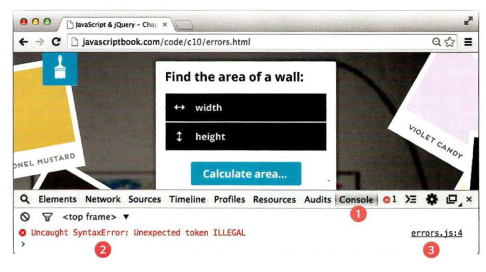
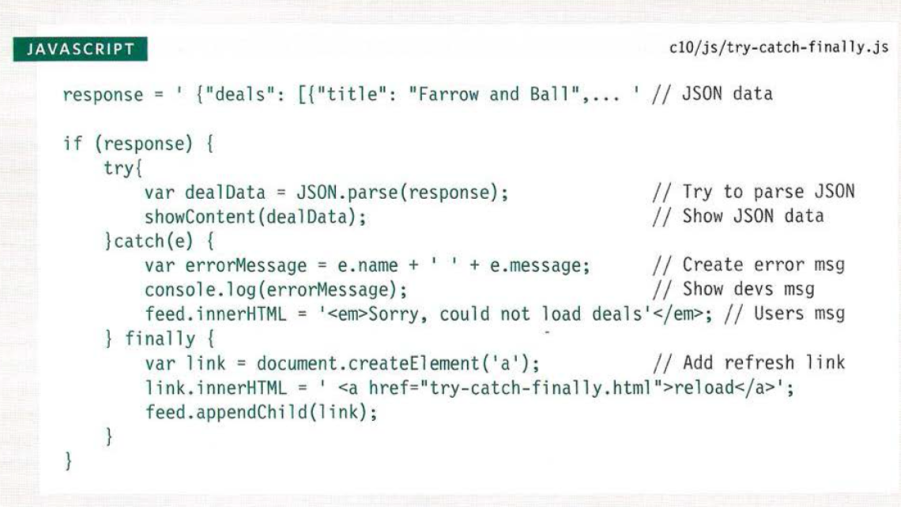

# Error Handling & Debugging

## EXECUTION CONTEXT & HOISTING
Each time a script enters a new execution context, there are two phases
of activity:
1. PREPARE
* The new scope is created
* Variables, functions, and arguments are created
* The value of the this keyword is determined

2. EXECUTE
* Now it can assign values to variables
* Reference functions and run their code
* Execute statements

## UNDERSTANDING ERRORS
If a JavaScript statement generates an error, then it throws an **exception**.
you can use a set of statements to handle the error.

### ERROR OBJECTS
Error objects can help you find where your mistakes are and browsers have tools to help you read them.
* When an Error object is created, it will contain the following properties:

PROPERTY | DESCRIPTION
---------|-------------
name  | Type of execution
message | Description
fileNumber |Name of the JavaScript file
lineNumber | Line number of error

* There are seven types of built-in error objects in JavaScript:

OBJECT  |DESCRIPTION
--------|---------
Error |Generic error - the other errors are all based upon this error
Syntax Error|Syntax has not been followed
ReferenceError | Tried to reference a variable that is not declared/within scope
TypeError | An unexpected data type that cannot be coerced
Range Error |Numbers not in acceptable range
URI Error |encodeURI ().decodeURI(),and similar methods used incorrectly
EvalError |eval () function used incorrectly

## Syntax Error
* SYNTAX IS NOT CORRECT
This is caused by incorrect use of the rules of the language. It is often the result of a simple typo.

* MISMATCHING OR UNCLOSED QUOTES

>document.write ("Howdyl );
>SyntaxError: Unexpected EOF

* MISSING CLOSING BRACKET
document.getElementByid('page' I SyntaxErr or : Expected token ' ) '
* MISSING COMMA IN ARRAY

>Would be same for missing] at the end
>var list = ['Item 1', 'Item 2 ' 'rtem 3'];
>SyntaxError: Expected token ']'

* MALFORMED PROPERTY NAME
It has a space but is not surrounded by quote marks

>user = { first name: "Ben", lastName: "Lee"};
>Synt axError: Expected an identifier but found 'name ' instead

## ReferenceError
* VARIABLE DOES NOT EXIST
This is caused by a variable that is not declared or is
out of scope.

VARIABLE IS UNDECLARED

```
var wi dth = 12 ;
var area = width * Height ;
ReferenceError: Can't find variable:
height
```

* NAMED FUNCTION IS UNDEFINED

```
document.write ( randomFunction() ) ;
ReferenceError: Can't find variable :
randomFunction
```

## HOW TO DEAL WITH ERRORS ?
1. DEBUG THE SCRIPT TO FIX ERRORS
If you come across an error while writing a script
(or when someone reports a bug), you will need to
debug the code, track down the source of the error,
and fix it.
2. HANDLE ERRORS GRACEFULLY
You can handle errors gracefully using try, catch,
throw, and finally statements.


## Debugging is about deduction


### HOW TO LOOK AT ERRORS IN CHROME



## HANDLING EXCEPTIONS

```
try {
II Try to execute this code
catch (exception) {
II If there is an exception, run this code
finally {
II This always gets executed
TRY
```
* **TRY**
First, you specify the code
that you think might throw an
exception within the try block.
If an exception occurs in this
section of code, control is
automatically passed to the
corresponding catch block.
The try clause must be used in
this type of error handling code,
and it should always have either
a catch, fi na 1 ly, or both.

* **CATCH**
If the try code block throws an
exception, catch steps in with an
alternative set of code.
It has one parameter: the error
object. Although it is optional,
you are not handling the error if
you do not catch an error.
The ability to catch an error can
be very helpful if there is an issue
on a live website.

* **FINALLY**
The contents of the fi na 11 y
code block will run either
way - whether the try block
succeeded or failed.
It even runs if a return keyword
is used in the try or catch block.
It is sometimes used to clean up
after the previous two clauses.



## COMMON ERRORS

* MISSED/ EXTRA CHARACTERS
* DATA TYPE ISSUES

*Read more about Errors:* [Here](https://www.w3schools.com/js/js_mistakes.asp)


