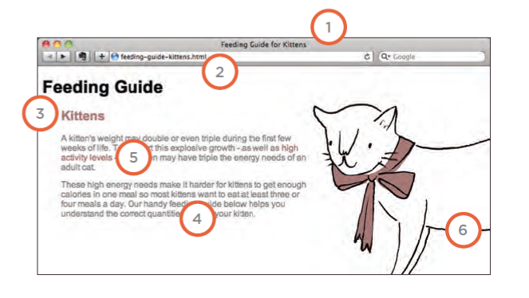
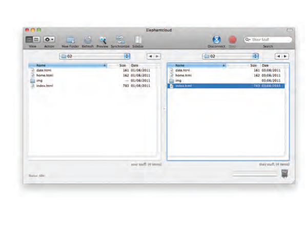

# Audio, Video, Images
## images
### Controlling size of images in CSS

>img.large { width: 500px; height: 500px;}
>img.medium { width: 250px; height: 250px;}
>img.small { width: 100px; height: 100px;}

* Aligning images

>img.align-left { float: left; margin-right: 10px;}
>img.align-right { float: right; margin-left: 10px;}


### Repeating Images 

**repeat**

The background image is
repeated both horizontally and
vertically (the default way it
is shown if the backgroundrepeat
property isn't used).

**repeat-x**

The image is repeated horizontally only

**repeat-y**
The image is repeated vertically
only.

**no-repeat**
The image is only shown once.
The background-attachment
property specifies whether a
background image should stay in
one position or move as the user
scrolls up and down the page. 

**fixed**
The background image stays in
the same position on the page.

**scroll**
The background image moves
up and down as the user scrolls
up and down the page.

### Background Position
1. left top
2. left center
3. left bottom
4. center top
5. center center
6. center bottom
7. right top
8. right center
9. right bottom


### Image Rollovers & Sprites

Using CSS, it is possible to create
a link or button that changes to a
second style when a user moves
their mouse over it (known as a
rollover) and a third style when
they click on it.

*Some of css*

```
a.button {
height: 36px;
background-image: url("images/button-sprite.jpg");
text-indent: -9999px;
display: inline-block;}
a#add-to-basket {
width: 174px;
background-position: 0px 0px;}
a#framing-options {
width: 210px;
background-position: -175px 0px;}
a#add-to-basket:hover {
background-position: 0px -40px;}
a#framing-options:hover {
background-position: -175px -40px;}
a#add-to-basket:active {
background-position: 0px -80px;}
a#framing-options:active {
background-position: -175px -80px;}
```

## SEO
SEO is a huge topic and several books have been written on the subject.
The following pages will help you understand the key concepts so you can
improve your website's visibility on search engines.

### SEO is often split into two areas:

* **On-Page Techniques**

On-page techniques are the
methods you can use on your
web pages to improve their
rating in search engines



1.  Page Title
2. URL / Web Address
3. Headings
4. Text
5. Link Text
6. Image Alt Text
7. Page Descriptions


* **Off-Page Techniques**

Getting other sites to link to you
is just as important as on-page
techniques. Search engines help
determine how to rank your
site by looking at the number of
other sites that link to yours.


### snapshot of the key information you are likely to want to know. In particular, it tells you how many people are coming to your site.


### FTP & Third Party Tools
As the name suggests, File
Transfer Protocol (or FTP) allows
you to transfer files across the
Internet from your computer to
the web server hosting your site.
There are many FTP programs
that offer a simple interface
that shows you the files on your
computer alongside the files that
are on your web server. These
allow you to drag and drop
files from your computer to the
server or vice versa.




## HTML5 video and audio

* video
The \<video> HTML element embeds a media player which supports video playback into the document.

*Example on how to Embed video in html:*

```
<video controls width="250">

    <source src="/media/cc0-videos/flower.webm"
            type="video/webm">

    <source src="/media/cc0-videos/flower.mp4"
            type="video/mp4">

    Sorry, your browser doesn't support embedded videos.
</video>
```

* Audio 

The \<audio> HTML element is used to embed sound content in documents.

*Example on how to Embed audio in html:*


```
   <audio>
        controls
        src="/media/cc0-audio/t-rex-roar.mp3">
            Your browser does not support the
            <code>audio</code> element.
    </audio>

```

read more about [Video](https://developer.mozilla.org/en-US/docs/Web/HTML/Element/video) and [Audio](https://developer.mozilla.org/en-US/docs/Web/HTML/Element/audio)

