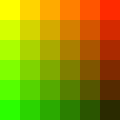
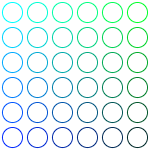
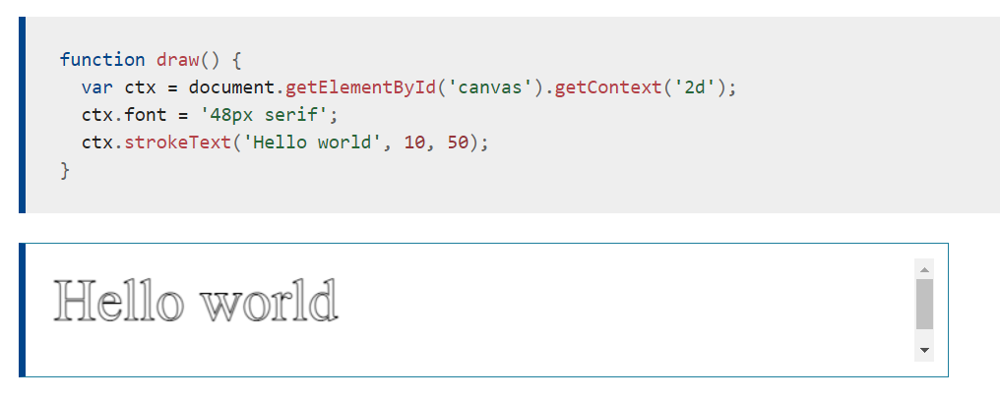

#  Chart.js, Canvas

## Chart.js
Chart.js is a free open-source JavaScript library for [data visualization](https://en.wikipedia.org/wiki/Data_visualization) , which supports 8 chart types: bar, line, area, pie (doughnut), bubble, radar, polar, and scatter.


### chart types
1. [line](https://www.chartjs.org/docs/latest/charts/line.html)
2. [bar](https://www.chartjs.org/docs/latest/charts/bar.html)
3. [area](https://www.chartjs.org/docs/latest/charts/area.html)
4. [pie](https://www.chartjs.org/docs/latest/charts/doughnut.html)
5. [bubble]https://www.chartjs.org/docs/latest/charts/bubble.html()
6. [radar](https://www.chartjs.org/docs/latest/charts/radar.html)
7. [polar](https://www.chartjs.org/docs/latest/charts/polar.html)
8. [scatter](https://www.chartjs.org/docs/latest/charts/scatter.html)

### Creating a Chart
*create a bar chart for a single dataset and render *

```
<canvas id="myChart" width="400" height="400"></canvas>
<script>
var ctx = document.getElementById('myChart').getContext('2d');
var myChart = new Chart(ctx, {
    type: 'bar',
    data: {
        labels: ['Red', 'Blue', 'Yellow', 'Green', 'Purple', 'Orange'],
        datasets: [{
            label: '# of Votes',
            data: [12, 19, 3, 5, 2, 3],
            backgroundColor: [
                'rgba(255, 99, 132, 0.2)',
                'rgba(54, 162, 235, 0.2)',
                'rgba(255, 206, 86, 0.2)',
                'rgba(75, 192, 192, 0.2)',
                'rgba(153, 102, 255, 0.2)',
                'rgba(255, 159, 64, 0.2)'
            ],
            borderColor: [
                'rgba(255, 99, 132, 1)',
                'rgba(54, 162, 235, 1)',
                'rgba(255, 206, 86, 1)',
                'rgba(75, 192, 192, 1)',
                'rgba(153, 102, 255, 1)',
                'rgba(255, 159, 64, 1)'
            ],
            borderWidth: 1
        }]
    },
    options: {
        scales: {
            y: {
                beginAtZero: true
            }
        }
    }
});
</script>
```

### General of proprities in Bar chart
Name  |	Description
------|-------------
base  |	Base value for the bar in data units along the value axis. If not set, defaults to the value axis base value.
clip  |	How to clip relative to chartArea. Positive value allows overflow, negative value clips that many pixels inside chartArea. 
grouped |Should the bars be grouped on index axis. When true, all the datasets at same index value will be placed next to each other centering on that index value. When false, each bar is placed on its actual index-axis value.
indexAxis |	The base axis of the dataset. 'x' for vertical bars and 'y' for horizontal bars.
label|	The label for the dataset which appears in the legend and tooltips.
order |	The drawing order of dataset. Also affects order for stacking, tooltip, and legend.
skipNull |	If true, null or undefined values will not be used for spacing calculations when determining bar size.
stack |	The ID of the group to which this dataset belongs to (when stacked, each group will be a separate stack). more
xAxisID |	The ID of the x-axis to plot this dataset on.
yAxisID |	The ID of the y-axis to plot this dataset on

### Styling
The style of each bar can be controlled with the following properties:
Name |	Description
-----|----------
backgroundColor | 	The bar background color.
borderColor |	The bar border color.
borderSkipped |The edge to skip when drawing bar.
borderWidth |The bar border width (in pixels).
borderRadius |The bar border radius (in pixels).
minBarLength | 	Set this to ensure that bars have a minimum length in pixels.
pointStyle |	Style of the point for legend. 

### nteractions
The interaction with each bar can be controlled with the following properties:


Name |	Description
------|----------
hoverBackgroundColor |	The bar background color when hovered.
hoverBorderColor| The bar border color when hovered.
hoverBorderWidth  |The bar border width when hovered (in pixels).
hoverBorderRadius	|The bar border radius when hovered (in pixels).

## Drawing shapes with canvas
### Drawing rectangles
* There are three functions that draw rectangles on the canvas:*

**Draws a filled rectangle**
> fillRect(x, y, width, height)

**Draws a rectangular outline.**
> strokeRect(x, y, width, height)

**Clears the specified rectangular area, making it fully transparent.**
> clearRect(x, y, width, height)

*Rectangular shape example*

```
function draw() {
  var canvas = document.getElementById('canvas');
  if (canvas.getContext) {
    var ctx = canvas.getContext('2d');

    ctx.fillRect(25, 25, 100, 100);
    ctx.clearRect(45, 45, 60, 60);
    ctx.strokeRect(50, 50, 50, 50);
  }
}
```
*Output*


## Moving the pen

When the canvas is initialized or `beginPath()` is called, you typically will want to use the `moveTo()` function to place the starting point somewhere else. We could also use ` moveTo()` to draw unconnected paths. Take a look at the smiley face below.

## Applying styles and colors

### Colors
there are two important properties we can use: **fillStyle** and **strokeStyle**

* A fillStyle example
n this example, we once again use two for loops to draw a grid of rectangles, each in a different color. The resulting image should look something like the screenshot. There is nothing too spectacular happening here. We use the two variables i and j to generate a unique RGB color for each square, and only modify the red and green values. The blue channel has a fixed value. By modifying the channels, you can generate all kinds of palettes.




* A strokeStyle example
This example is similar to the one above, but uses the strokeStyle property to change the colors of the shapes' outlines. We use the `arc()` method to draw circles instead of squares.

```
  function draw() {
    var ctx = document.getElementById('canvas').getContext('2d');
    for (var i = 0; i < 6; i++) {
      for (var j = 0; j < 6; j++) {
        ctx.strokeStyle = 'rgb(0, ' + Math.floor(255 - 42.5 * i) + ', ' +
                         Math.floor(255 - 42.5 * j) + ')';
        ctx.beginPath();
        ctx.arc(12.5 + j * 25, 12.5 + i * 25, 10, 0, Math.PI * 2, true);
        ctx.stroke();
      }
    }
  }
```


### Shadows
*Using shadows involves just four properties:*

> shadowOffsetX = float
Indicates the horizontal distance the shadow should extend from the object. This value isn't affected by the transformation matrix. The default is 0.

> shadowOffsetY = float
Indicates the vertical distance the shadow should extend from the object. This value isn't affected by the transformation matrix. The default is 0.

> shadowBlur = float
Indicates the size of the blurring effect; this value doesn't correspond to a number of pixels and is not affected by the current transformation >matrix. The default value is 0.

shadowColor = color
A standard CSS color value indicating the color of the shadow effect; by default, it is fully-transparent black.

## Drawing text

The canvas rendering context provides two methods to render text:


`fillText(text, x, y [, maxWidth])`

Fills a given text at the given (x,y) position. Optionally with a maximum width to draw.

`strokeText(text, x, y [, maxWidth])`

Strokes a given text at the given (x,y) position. Optionally with a maximum width to draw.


**A strokeText example**
The text is filled using the current strokeStyle.


### Related Topics 
[Basic usage of canvas](https://developer.mozilla.org/en-US/docs/Web/API/Canvas_API/Tutorial/Basic_usage) , [
See also
Optimizing canvas](https://developer.mozilla.org/en-US/docs/Web/API/Canvas_API/Tutorial/Optimizing_canvas)