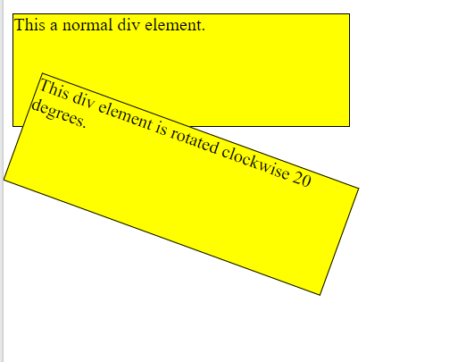
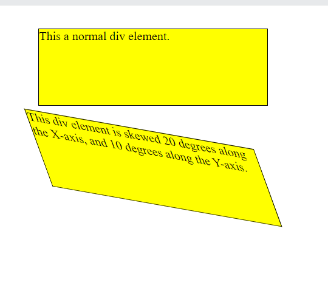
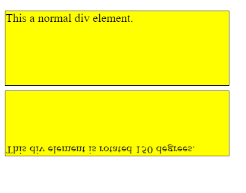
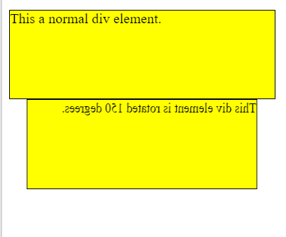
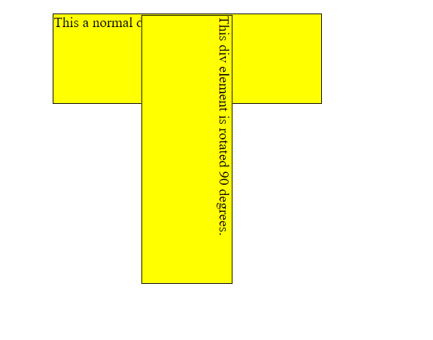

# CSS Transforms, Transitions, and Animations

## Transforms

The **transform** property comes in two different settings, two-dimensional and three-dimensional. Each of these come with their own individual properties and values.

### Transform Syntax

```
div {
  -webkit-transform: scale(1.5);
     -moz-transform: scale(1.5);
       -o-transform: scale(1.5);
          transform: scale(1.5);
}
```

### two-dimensional-transforms

* 2D Rotate
The *rotate()* method rotates an element clockwise or counter-clockwise according to a given degree.

The following *CSS* example rotates the \<div> element clockwise with 20 degrees


> div {   -ms-transform: rotate(20deg); /* IE 9 */ }
> div {  transform: rotate(20deg); /* Standard syntax */ }



* 2D Scale
The *scale()* method increases or decreases the size of an element (according to the parameters given for the width and height).

The following *CSS* example increases the \<div> element to be two times of its original width, and three times of its original height: 

```
div {
  margin: 150px;
  width: 200px;
  height: 100px;
  background-color: yellow;
  border: 1px solid black;
  -ms-transform: scale(2,3); /* IE 9 */
  transform: scale(2,3); /* Standard syntax */
}
```

* 2D Skew
The *skew()* method skews an element along the X and Y-axis by the given angles.

The following example skews the \<div> element 20 degrees along the X-axis, and 10 degrees along the Y-axis:




* 2D matrix 
The *matrix()* method combines all the 2D transform methods into one.

The matrix() method take six parameters, containing mathematic functions, which allows you to rotate, scale, move (translate), and skew elements.

**The parameters are as follow: matrix(scaleX(),skewY(),skewX(),scaleY(),translateX(),translateY())**

*EXAMPLE*

> div {   transform: matrix(1, -0.3, 0, 1, 0, 0); }

### CSS 3D Transforms

* rotateX()
The rotateX() method rotates an element around its X-axis at a given degree

> transform: rotateX(150deg)




* rotateY() 

The rotateY() method rotates an element around its Y-axis at a given degree
> transform: rotateY(150deg)



* rotateZ()

The rotateZ() method rotates an element around its Z-axis at a given degree

> transform: rotateZ(90deg)




## Transitions & Animations

### transitions
As mentioned, for a transition to take place, an element must have a change in state, and different styles must be identified for each state. The easiest way for determining styles for different states is by using the *:hover, :focus, :active, and :target* pseudo-classes.


**CSS Transition Properties**

Property  |	Description
----------|-------------
transition |	A shorthand property for setting the four transition properties into a single property
transition-delay |	Specifies a delay (in seconds) for the transition effect
transition-duration |	Specifies how many seconds or milliseconds a transition effect takes to complete
transition-property	| Specifies the name of the CSS property the transition effect is for
transition-timing-function |	Specifies the speed curve of the transition effect


### CSS3 TRANSITIONS some properity can do 

* Fade in

Fade in effects are coded in two steps: first, you set the initial state; next, you set the change, for example on hover:

```
.fade
{
        opacity:0.5;
}
.fade:hover
{
        opacity:1;
}
```

* Change color

> .color:hover { background:#53a7ea; }


* Grow & Shrink


To grow an element, you used to have to use its width and height, or its padding. But now we can use CSS3’s transform to enlarge

```
.grow:hover
{
        -webkit-transform: scale(1.3);
        -ms-transform: scale(1.3);
        transform: scale(1.3);
}
```

### see more [CSS3 Transition Example](https://www.webdesignerdepot.com/2014/05/8-simple-css3-transitions-that-will-wow-your-users)

## Animations
CSS Animations allows animation of HTML elements without using JavaScript or Flash!
1. An animation lets an element gradually change from one style to another.

2. You can change as many CSS properties you want, as many times as you want.

3. To use CSS animation, you must first specify some keyframes for the animation.

4. Keyframes hold what styles the element will have at certain times.

### Animations Keyframes
To set multiple points at which an element should undergo a transition, use the @keyframes rule. The @keyframes rule includes the animation name, any animation breakpoints, and the properties intended to be animated.

```
@keyframes slide {
  0% {
    left: 0;
    top: 0;
  }
  50% {
    left: 244px;
    top: 100px;
  }
  100% {
    left: 488px;
    top: 0;
  }
}
```

### Some other example on related topics : [Pure CSS Bounce Animation](https://codepen.io/dp_lewis/pen/gCfBv), [CodePen Home CSS3 Keyframes Animation](https://codepen.io/akshaychauhan/pen/oAfae), [CodePen Home 6 Buttons animated](https://codepen.io/retyui/pen/ByoaXV) .
