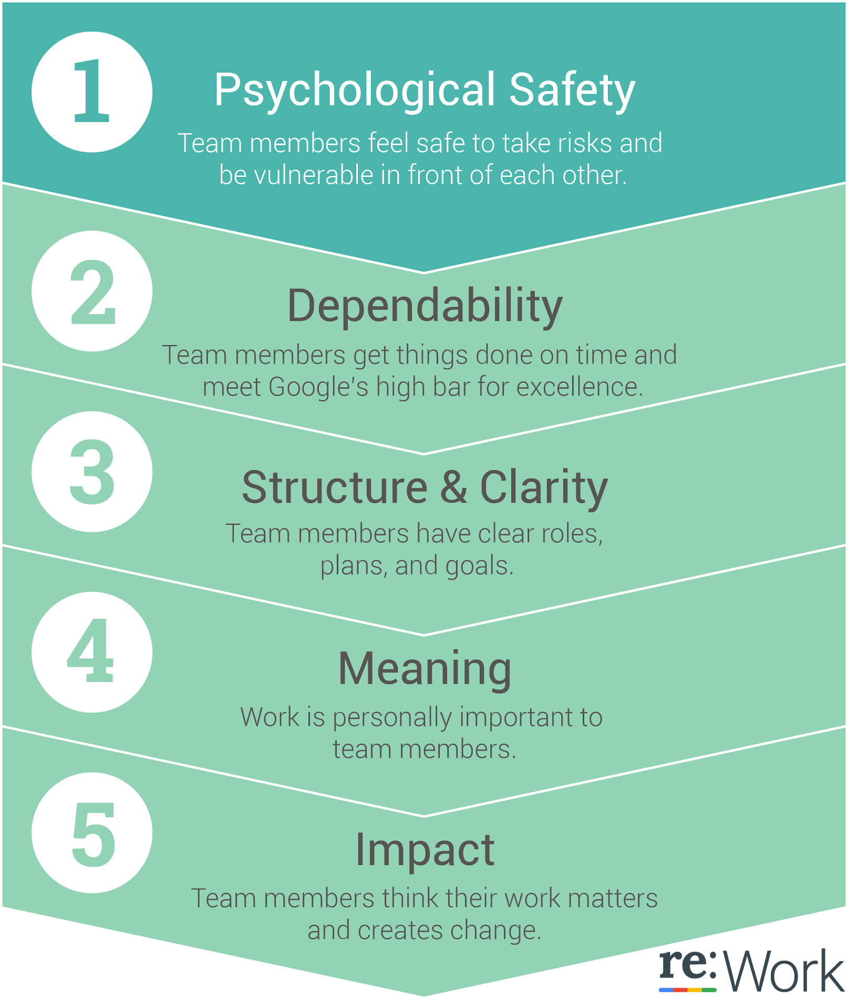

# What Google Learned About Teams

Team members at Google are challenged in much the same way as nearly everyone else in corporate life. To get things done, they need to come together fast and tackle complex tasks that have no easy solutions.

### The researchers at Google describe two factors that seem to make the biggest difference in creating psychologically safe environments for collaboration: 

1. relatively equivalent air time among all team members in their discussions

2. a high overall level of social sensitivity 

### Safety Starts with Leaders
Here are three essentials for leadership that make a difference:

* **Develop clear goals and ground rules**

People in teams need enough common focus to feel competent to do the work at hand--hard to find in a world that is always shifting under their feet. Whether it’s stated outcomes for a last-minute meeting, short-term milestones on a project path, or high level objectives in a charter, effective teams share a common view of what they are trying to accomplish. Period. 

**Psychological safety** cannot exist in an on-going state of ambiguity. While they may not know what the future will look like in a month or a year, they can be clear about the nature and scope of what they are working on right now. If it needs to change, so be it—and that requires a discussion, some decision-making, and a collective reset. 

* **Actively commit to creating psychological safety**

Google is hardly packed with touchy-feely types who expect to be talking about emotions at work. However, one leader described the value of having actual data that demonstrated the importance of paying attention to the subtle or even blatant barriers to people’s experience of safety on a team. The most common: Members getting shut down without a hearing on a controversial opinion, or being marginalized because of stylistic differences. 

* **Take a hard look in a good mirror**

Having the ability to see their impact on others is the place to start. A leader may truly believe in the power of collaboration, understand the importance of psychological safety on a team, AND continue to act in ways that create the opposite effect. I am continually astounded by how hard it can be for well-intentioned people to change their habits and patterns.

### The researchers found that what really mattered was less about who is on the team, and more about how the team worked together. In order of importance:

* **Psychological safety**: Psychological safety refers to an individual’s perception of the consequences of taking an interpersonal risk or a belief that a team is safe for risk taking in the face of being seen as ignorant, incompetent, negative, or disruptive. In a team with high psychological safety, teammates feel safe to take risks around their team members. They feel confident that no one on the team will embarrass or punish anyone else for admitting a mistake, asking a question, or offering a new idea.

* **Dependability**: On dependable teams, members reliably complete quality work on time (vs the opposite - shirking responsibilities).

* **Structure and clarity**: An individual’s understanding of job expectations, the process for fulfilling these expectations, and the consequences of one’s performance are important for team effectiveness. Goals can be set at the individual or group level, and must be specific, challenging, and attainable. Google often uses Objectives and Key Results (OKRs) to help set and communicate short and long term goals.

* **Meaning:** Finding a sense of purpose in either the work itself or the output is important for team effectiveness. The meaning of work is personal and can vary: financial security, supporting family, helping the team succeed, or self-expression for each individual, for example.

* **Impact:** The results of one’s work, the subjective judgement that your work is making a difference, is important for teams. Seeing that one’s work is contributing to the organization’s goals can help reveal impact.

### The researchers also discovered which variables were not significantly connected with team effectiveness at Google:

* Colocation of teammates (sitting together in the same office)
* Consensus-driven decision making
* Extroversion of team members
* Individual performance of team members
* Workload size
* Seniority
* Team size
* Tenure

