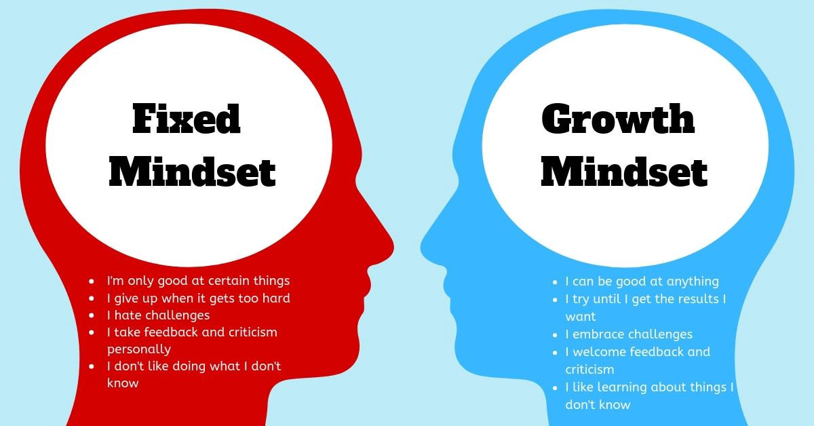

# growth mindset

### Fist of all a *mindset* is a set of assumptions, methods, or notions held by one or more people or groups of people.
### There are two main mindsets we can navigate life with: growth and fixed.
### In fixed mindset  people believe their intelligence or talent, are simply fixed traits. They spend their time documenting their intelligence or talent instead of developing them. They also believe that talent alone creates success without effort.
### In growth mindset people believe that their most basic abilities like intelligence or talent, can be developed through dedication and hard work—brains and talent are just the starting point. This view creates a love of learning and a resilience that is essential for great accomplishment
### so having a growth mindset is essential for success. :grinning: :grinning:

# What are the ways to develop a growth mindset ?
* ### **Reflect** , take time to acknowledge, reflect, and embrace all your failures. Becoming aware of your areas of improvement is the stepping stone in cultivating a growth mindset. Sweeping your weaknesses under the rug will only inhibit your ability to reach success.
* ### **Find your purpose** , Take time to reflect and find your purpose.
* ### **Take on challenges** , Part of developing a growth mindset is shattering the negative perception of a challenge.
* ### **Jot down goals** , Growth mindset people are aware that once one goal is down they have others lined up to pursue. Create clear, realistic goals based on your passion and purpose. And be sure to give yourself enough time to conquer them thoroughly.  

## :bowtie: For more explanation about growth mindset, watch this video -> [growth mindest vedio](https://youtu.be/M1CHPnZfFmU?t=6) 