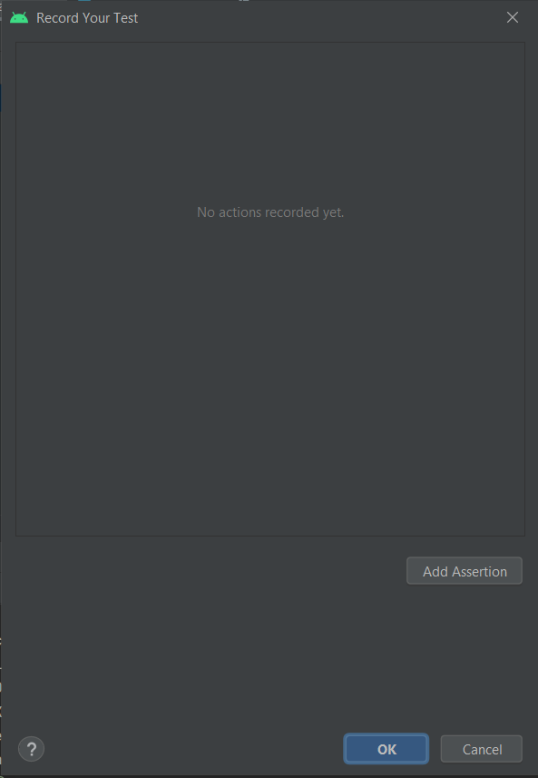
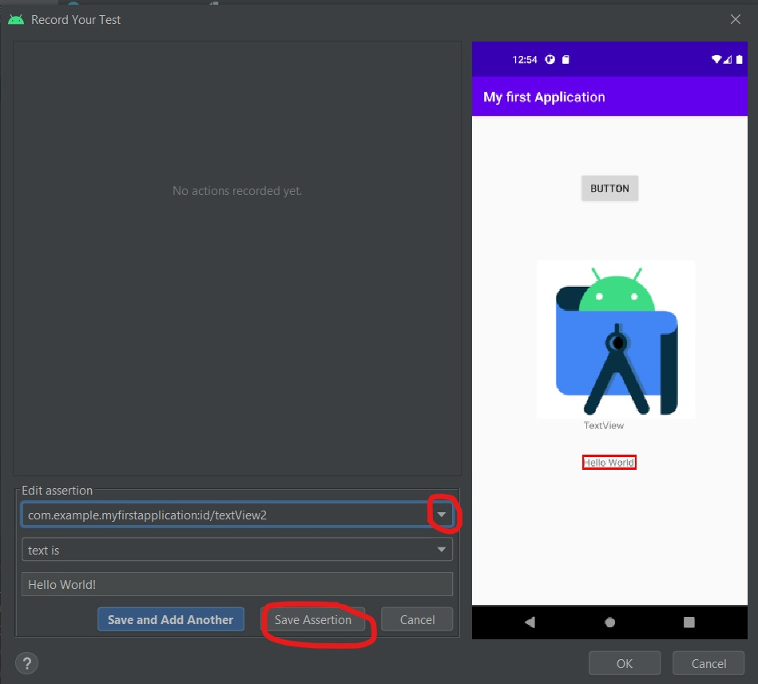
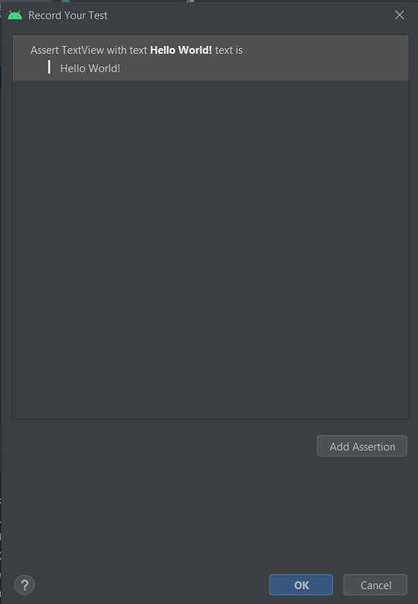
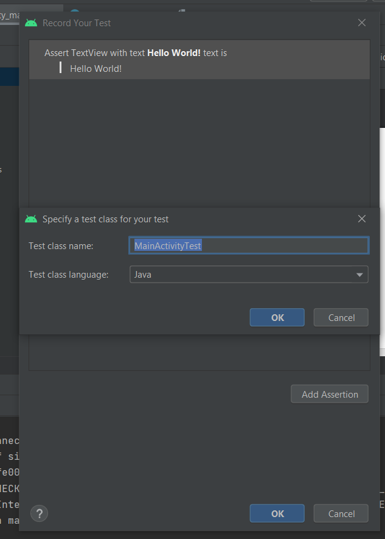
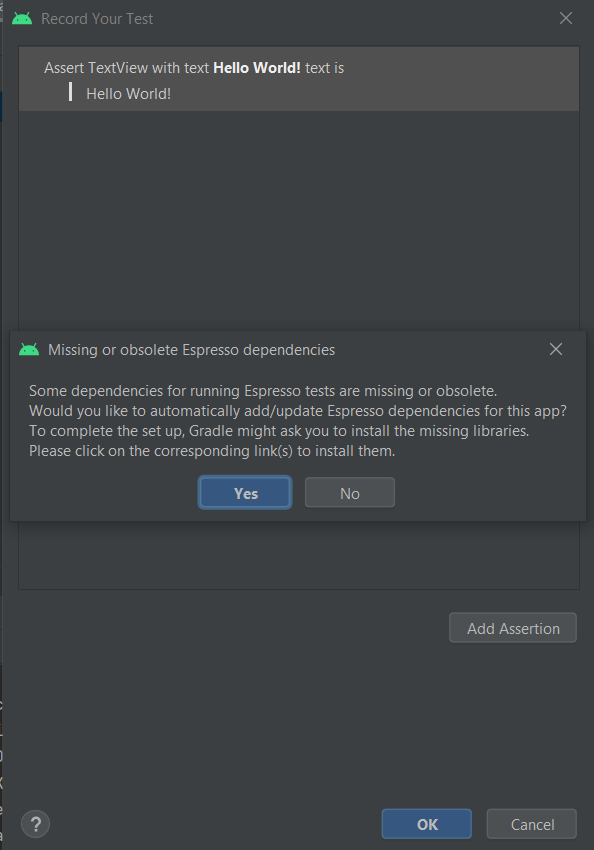
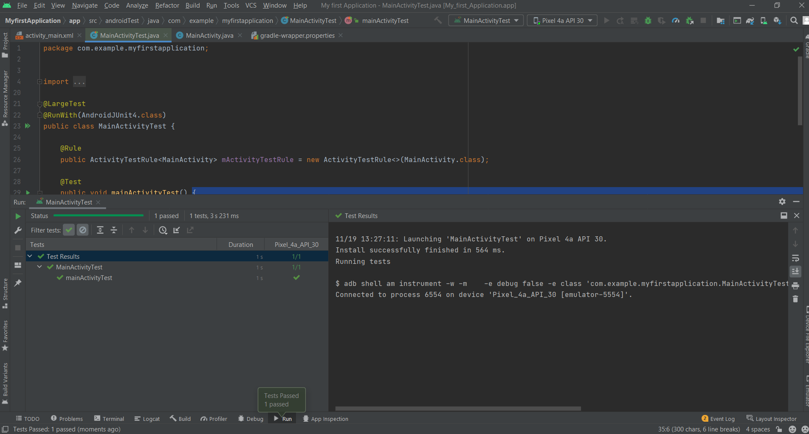

# Espresso

**Espresso** is a testing framework for Android to make it easy to write reliable user interface tests.

#### Espresso has basically three components:

* `ViewMatchers` - allows to find view in the current view hierarchy

* `ViewActions` - allows to perform actions on the views

* `ViewAssertions` - allows to assert state of a view

### Espresso Test Recorder
Espresso Test Recorder an approach to test creation for Android,  is a valuable tool to cut down the time required to write such a test. It's completely visual and provides a great starting point. It writes tests based on the Espresso Testing framework.

#### The Steps to start recording a test with Espresso Test Recorder

1. Click **Run > Record Espresso Test**.
2. In the Select Deployment Target window, choose the device on which you want to record the test and click **OK**.
3. The Recorder screenshot is as follows:



4. Click Add Assertion.

5. Click Hello World!. The Recorder screen to Select text view is as follows,and Click **Save Assertion**


6. After Click Save Assertion This will save the assertion and show it as follows,


7. Click OK. It will open a new window and ask the name of the test case. The default name is MainActivityTest,Change the test case name, if necessary.



8.  When you save a recording you do not need to manually set a dependency reference to the Espresso library because Test Recorder does this automatically as showen in below, Just Click yes.


9. Again, click **OK**. This will generate a file, MainActivityTest with our recorded test case. The complete coding is as follows,


```
package com.example.myfirstapplication;


import ...

@LargeTest
@RunWith(AndroidJUnit4.class)
public class MainActivityTest {

    @Rule
    public ActivityTestRule<MainActivity> mActivityTestRule = new ActivityTestRule<>(MainActivity.class);

    @Test
    public void mainActivityTest() {
        ViewInteraction textView = onView(
                allOf(withId(R.id.textView2), withText("Hello World!"),
                        withParent(withParent(withId(android.R.id.content))),
                        isDisplayed()));
        textView.check(matches(withText("Hello World!")));
    }
}

```
### Run an Espresso test locally

