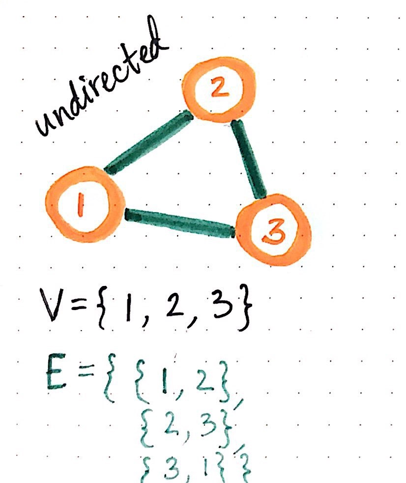
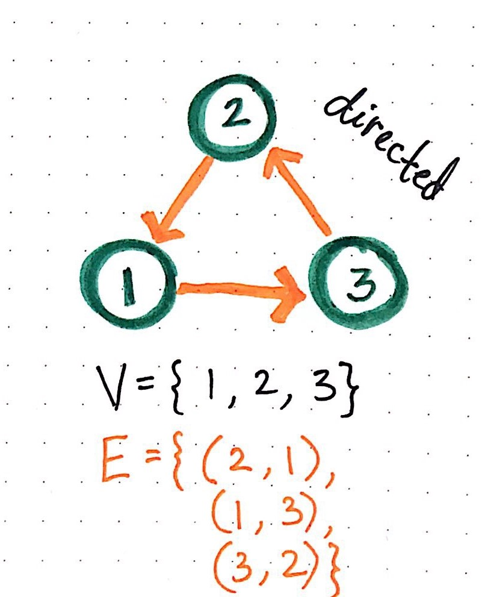
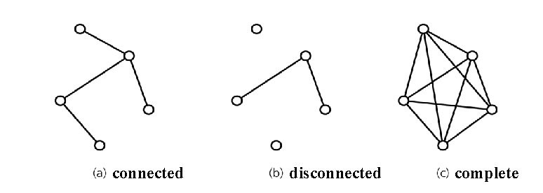

# Graphs
Graphs non-linear data structure consisting of nodes and edges. The nodes are sometimes also referred to as vertices and the edges are lines or arcs that connect any two nodes in the graph. used to represent the connection between pairs of objects.

### Some common terminology:
* **Vertex** − Each node of the graph is represented as a vertex. is a data object that can have zero or more adjacent vertices.

* **Edge** − Edge represents a path between two vertices or a line between two vertices. 

* **Neighbor** - The neighbors of a node are its adjacent nodes, are connected via an edge.
* **Degree** -  is the number of edges connected to that vertex.

* **Adjacency** − Two node or vertices are adjacent if they are connected to each other through an edge. 

* **Path** − Path represents a sequence of edges between the two vertices.

## Directed vs Undirected


### Undirected graph
An undirected graph is a set of nodes and a set of links between the nodes, as shown at pic above Node 1 is connected to Node 2 and Node 3. There are no **“directions”** given to point to specific vertices. The connection is bi-directional.
* The undirected graph we are looking at has 3 vertices and 3 undirected edges.

* Vertices/Nodes = {1,2,3}

* Edges = {(1,2),(1,3),(2,3)}

### Directed graph

A Directed Graph also called a Digraph is a graph where every edge is directed.
* The Digraph has arrows pointing to specific nodes.
* The directed graph we are looking at has 3 vertices and 3 undirected edges.

* Vertices/Nodes = {1,2,3}

* Edges = {(2,1),(3,2),(1,3)}

### Complete vs Connected vs Disconnected


1. A **connected** graph is graph that has all of vertices/nodes have at least one edge.
2. A **disconnected** graph is a graph where some vertices may not have edges.

3. A **complete** graph is when all nodes are connected to all other nodes.

### Acyclic vs Cyclic


A *cyclic* graph is a directed graph that contains a path from at least one node back to itself. An **acyclic** graph is a directed graph that contains absolutely no cycle.


### Graph Representation
We represent graphs through:

1. Adjacency Matrix
2. Adjacency List

### Adjacency Matrix
Is a square matrix used to represent a finite graph,is represented through a 2-dimensional array.Each Row and column represents each vertex of the data structure.

**Example:**


### Adjacency List
An adjacency list is a collection of unordered lists used to represent a finite graph.

**Example:**


### Weighted Graphs
A weighted graph is a graph in which each branch is given a numerical weight.

### Traversal graph
efers to the process of visiting (checking and/or updating) each vertex in a graph.
#### **Breadth First traversal** 
is algorithm traverses a graph in a breadthward motion and uses a queue to remember to get the next vertex to start a search, when a dead end occurs in any iteration. It employs the following rules:

1. Visit the adjacent unvisited vertex. Mark it as visited. Display it. Insert it in a queue.

2. If no adjacent vertex is found, remove the first vertex from the queue.

3. Repeat Rule 1 and Rule 2 until the queue is empty.
This is the code for a breadth first traversal:

```
ALGORITHM BreadthFirst(vertex)
    DECLARE nodes <-- new List()
    DECLARE breadth <-- new Queue()
    DECLARE visited <-- new Set()

    breadth.Enqueue(vertex)
    visited.Add(vertex)

    while (breadth is not empty)
        DECLARE front <-- breadth.Dequeue()
        nodes.Add(front)

        for each child in front.Children
            if(child is not visited)
                visited.Add(child)
                breadth.Enqueue(child)   

    return nodes;
```
##### Depth First traversal
Is algorithm traverses a graph in a depthward motion and uses a stack to remember to get the next vertex to start a search, when a dead end occurs in any iteration. It employs the following rules:

1. Visit the adjacent unvisited vertex. Mark it as visited. Display it. Push it in a stack.

2. If no adjacent vertex is found, pop up a vertex from the stack. (It will pop up all the vertices from the stack, which do not have adjacent vertices.)

3. Repeat Rule 1 and Rule 2 until the stack is empty.


### Real World Uses of Graphs
Examples of graphs in use *GPS and Mapping, Driving Directions, Social Networks, Airline Traffic, Netflix uses graphs for suggestions of products.*
